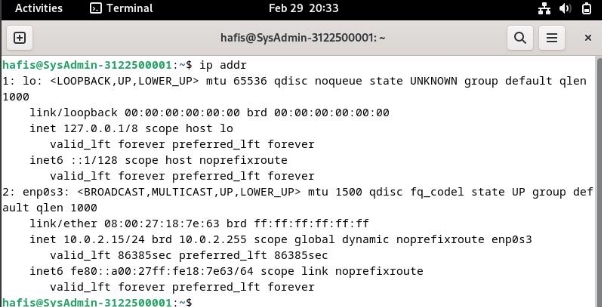
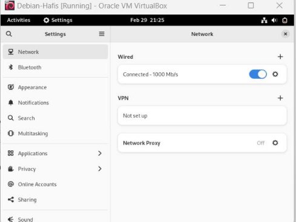
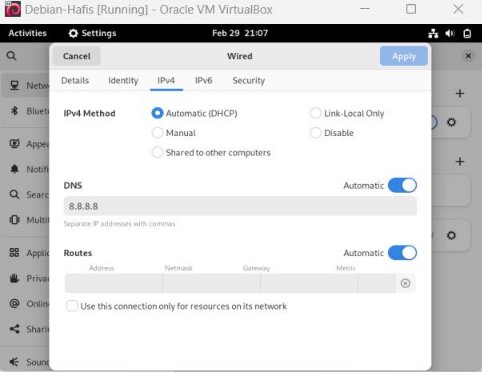
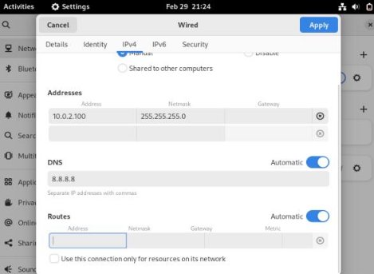

**Mengubah Alamat IP Dinamis Menjadi Statis Menggunakan Network Manager** 

Sebelum alamat ip diubah kita cek terlebih dahulu IP address kita yang diberikan oleh DHCP 

**~$ ip addr** atau bisa juga dengan **~$ sudo route -n** (dengan catatan telah menginstall package net-tools) 

Dapat dilihat kita mendapat IP 10.0.2.15/24 gateway 0.0.0.0 dan netmask 255.255.255.0 di interface enp0s3 

Kita akan mencoba mengubah alamat IP nya menjadi 10.0.2.100/24 

1. Pergi ke setting kemudian ke tab network 

   

2. Kemudian klik tombol gerigi dibagian wired 
2. Pindah ke tab ipv4 

   

4. Ubah ke manual 
4. Masukan Konfigurasi alamat IP 

   

- Address : 10.0.2.100 
- Netmask : 255.255.255.0 
- DNS : 8.8.8.8 
6. Klik Apply 
6. Kemudian cek menggunakan **~$ ip addr**  

   

8. Lakukan pengujian  

   
