

  <h1 style="text-align: center;font-weight: bold">Praktikum 3 Mikrotik</h1>
  <h4 style="text-align: center;">Dosen Pengampu : Dr. Ferry Astika Saputra, S.T., M.Sc.</h4>

 

  
  <h3 style="text-align: center;">Disusun Oleh :  Kelompok 3</h3>
  

    <strong>Ade Hafis Rabbani (3122500001)</strong> 
    <strong>Nadila Aulya Salsabila Mirdianti (3122500002)</strong> 
    <strong>Gandi Rukmaning Ayu (3122500016)</strong>
  

  
  <h3 style="text-align: center;line-height: 1.5">Politeknik Elektronika Negeri Surabaya Departemen Teknik Informatika Dan Komputer Program Studi Teknik Informatika 2023/2024</h3>
  

## Daftar Isi

- [Daftar Isi](#daftar-isi)
  - [1. Apa itu Mikrotik?](#1-apa-itu-mikrotik)
  - [2. Penjelasan](#2-penjelasan)

### 1. Apa itu Mikrotik?
**Pengertian Mikrotik**

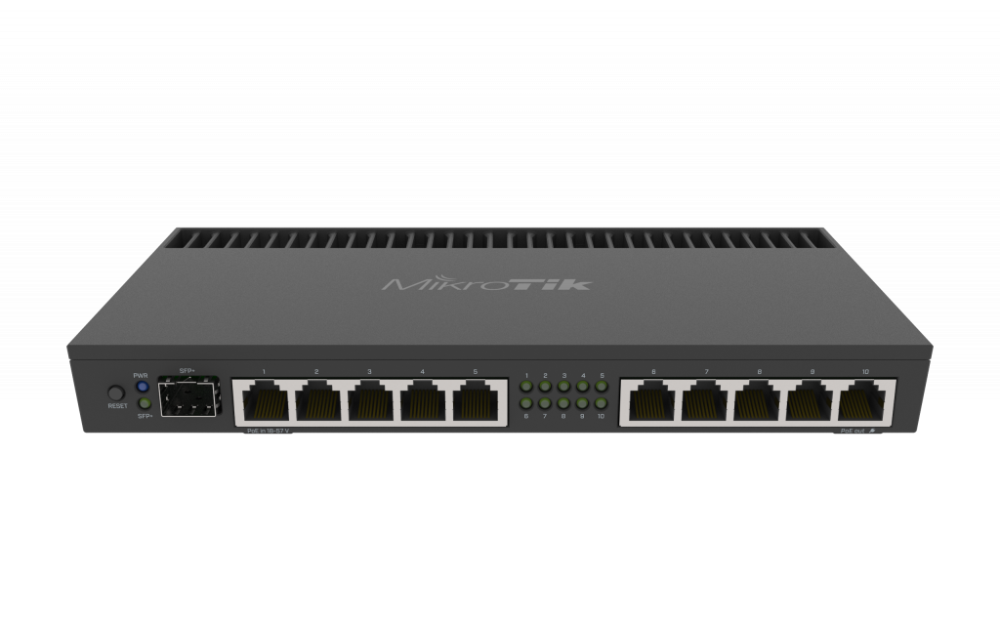

Mikrotik merupakan sebuah sistem operasi berbasis perangkat lunak (software) yang digunakan untuk mengubah komputer menjadi sebuah router dalam suatu jaringan. Menggunakan sistem operasi yang berbasis Linux dan menjadi dasar bagi router jaringan. Sistem operasi ini sangat ideal untuk mengelola administrasi jaringan komputer dengan berbagai skala, mulai dari kecil hingga besar.

Namun, masih banyak orang yang memiliki kesalahpahaman mengenai konsep Mikrotik dan router. Jika Mikrotik adalah suatu sistem operasi yang termasuk dalam kategori open source, maka router adalah perangkat keras yang berfungsi sebagai penghubung antara dua jaringan atau lebih. Jadi, perbedaan mendasar antara keduanya adalah bahwa Mikrotik adalah perangkat lunak (software) sedangkan router berperan sebagai perangkat keras (hardware).

### 2. Penjelasan
1. Buka aplikasi **Mikrotik**.

2. Step 2

   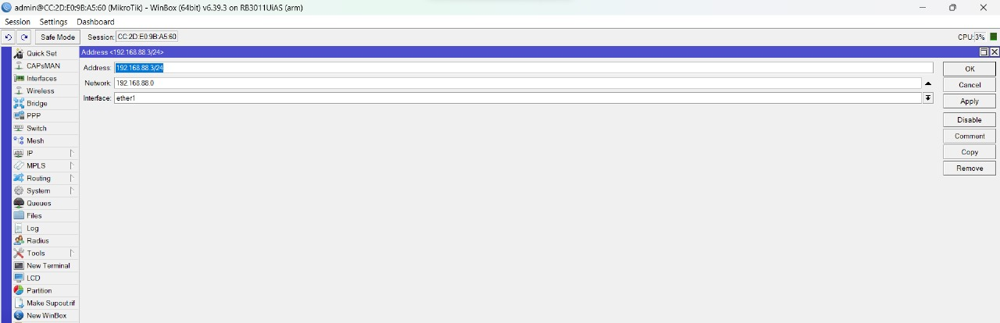
   
   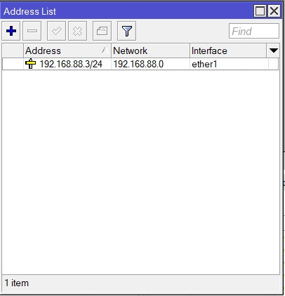

   Membuat IP Address untuk interface ether1 (192.168.88.3/24)
3. Step 3
   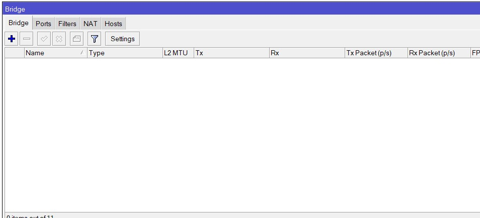
   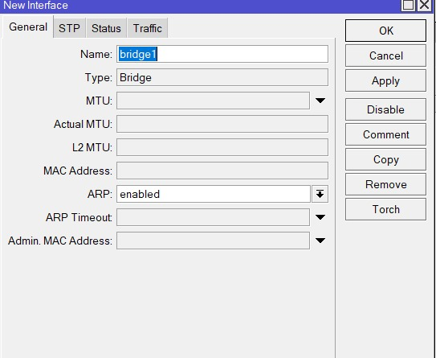
   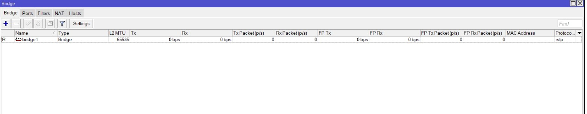
   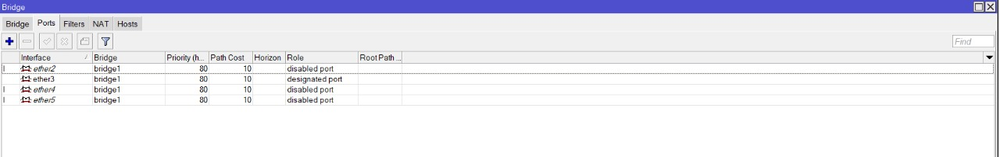
   Membuat bridge untuk menghubungkan ether2-5 dengan ether1 untuk menjadikan sebagai switch
4. Step 4
   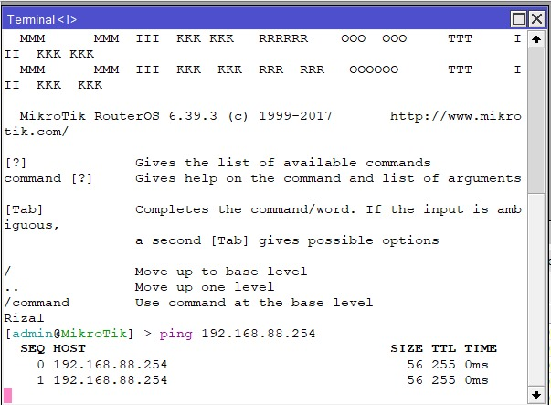
   lakukan pengujian apakah bisa terhubung dengan gateway

5. Step 5

   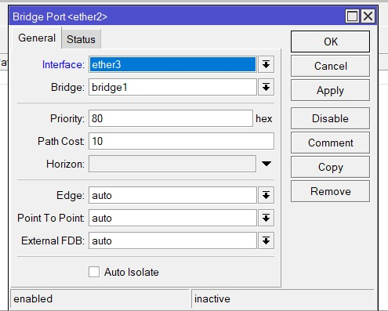

6.  Step 6

    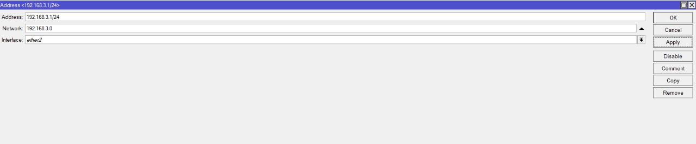
    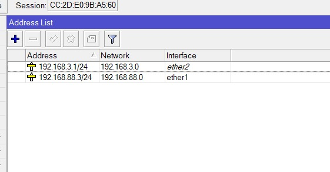

    Tambahkan IP address untuk ether 2
7.  Step 7

    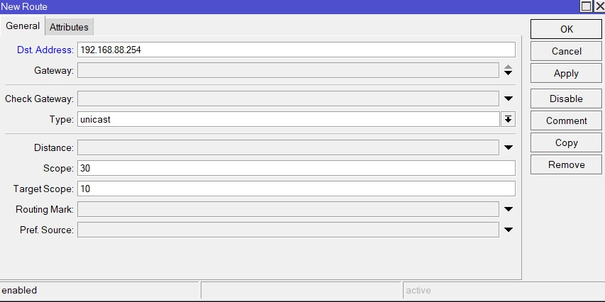
    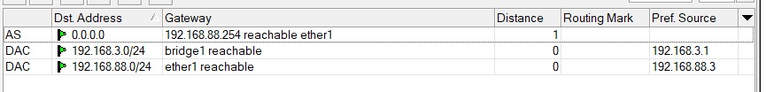
    agar bisa terhubung ke internet kita mengatur route agar semua interface nantinya akan di 

8.  Step 8
   
    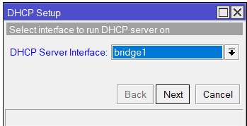
    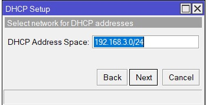
    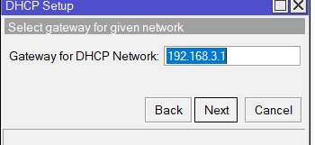
    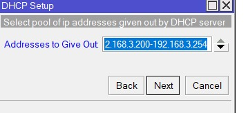
    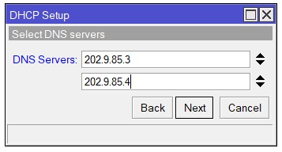
    
    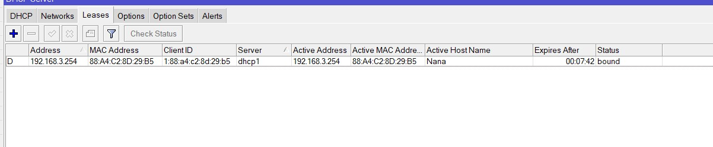
    Membuat DHCP server untuk client yang akan terhubung pada interface bridge yang sudah dibuat tadi dengan range IP 200-254 dan menggunakan DNS dari PENS
    

9.  Step 9
    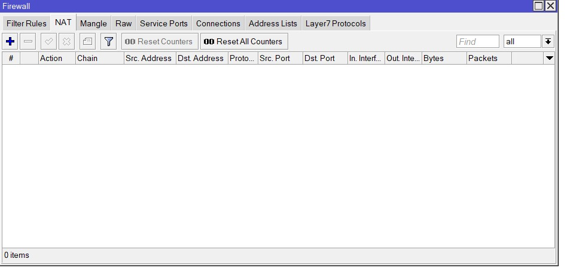
    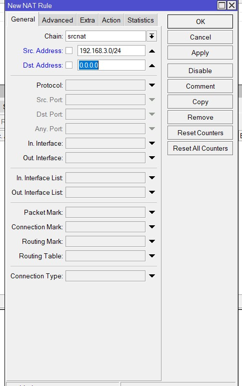
    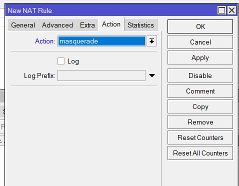
    Membuat NAT agar client bisa terhubung ke internet, dengan mengatur General, masukkan interface yang akan di NAT, dan masukkan IP address yang akan di NAT dan masukkan action masquerade

10. Step 10
    
    Hubungkan kabel dari ether 2 ke laptop dan cek apakah sudah bisa terhubung ke internet
    jika sudah maka akan muncul lease yang diberikan oleh DHCP server