

  <h1 style="text-align: center;font-weight: bold">Praktikum 3 Cleaning The System</h1>
  <h4 style="text-align: center;">Dosen Pengampu : Dr. Ferry Astika Saputra, S.T., M.Sc.</h4>

 

  
  <h3 style="text-align: center;">Disusun Oleh :  Kelompok 3</h3>
  

    <strong>Ade Hafis Rabbani (3122500001)</strong> 
    <strong>Nadila Aulya Salsabila Mirdianti (3122500002)</strong> 
    <strong>Gandi Rukmaning Ayu (3122500016)</strong>
  

  
  <h3 style="text-align: center;line-height: 1.5">Politeknik Elektronika Negeri Surabaya Departemen Teknik Informatika Dan Komputer Program Studi Teknik Informatika 2023/2024</h3>
  

## Daftar Isi

1. [Disk Space Information](#1-disk-space-information-)
2. [Cleaning The Package](#2-cleaning-the-package-)
3. [Emptying The Trash Bin](#3-emptying-the-trash-bin-)
4. [Purging Application Caches](#4-purging-application-caches-)
5. [Purging The Thumbnails](#5-purging-the-thumbnails-)

## Cleaning The System
Meskipun hard disk semakin besar kapasitasnya, kita mungkin masih memerlukan ruang kosong. Ada beberapa skrip otomatis untuk membersihkan disk, tapi lebih baik periksa ruang yang tersedia terlebih dahulu menggunakan perintah **rm**.

### 1. Disk Space Information
Hal pertama yang harus dilakukan adalah mengetahui ruang yang digunakan oleh disk. Beberapa tools tersedia, dimulai dari terminal:
#### a. Disk space in terminal mode
Ringkasan penggunaan ruang disk untuk setiap pemsangan sistem (disk dan partisi) dengan perintah
  df -h
  
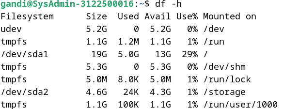

#### b. List your repertories sorted by decreasing size
Lihat direktori anda yang berukuran besar dengan perintah du dan sort (satuan yang digunakan adalah megabyte):
  du -ms * | sort -nr
  
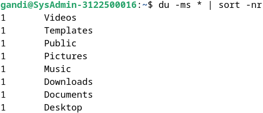

#### c. Ncdu
Tools untuk melakukan analisis ruang disk dalam mode console. Gunakan perintah ncdu untuk menjalankan di terminal.
  sudo apt update && sudo apt install ncdu
  
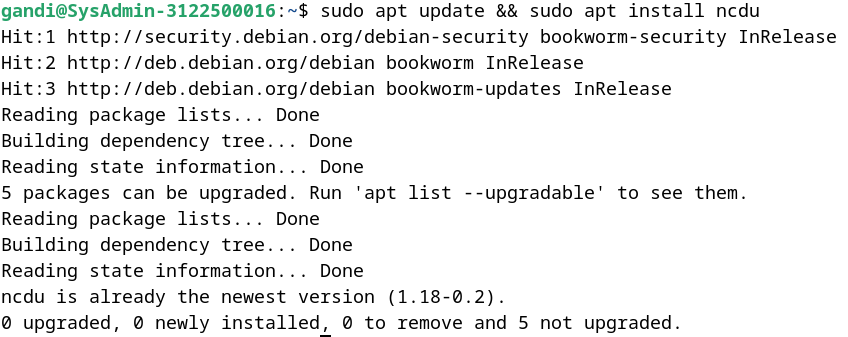
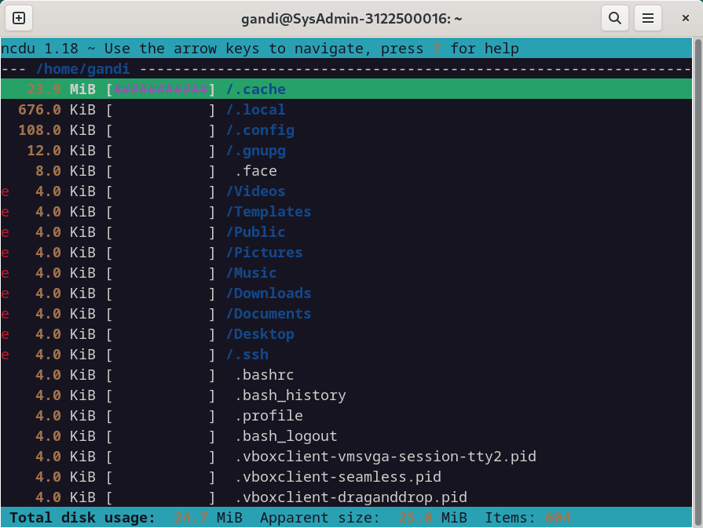

_Ncdu dijalankan di folder pribadi pengguna_

#### d. Baobab
Analisis ruang disk dalam mode grafis yang terintegrasi dengan Gnome, tetapi tersedia di environments lain.
  sudo apt update && sudo apt install baobab
  
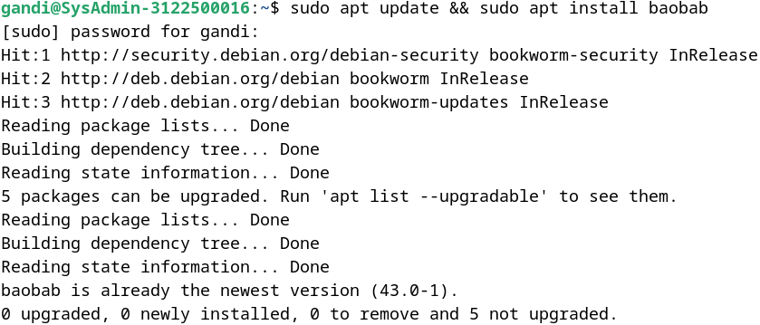
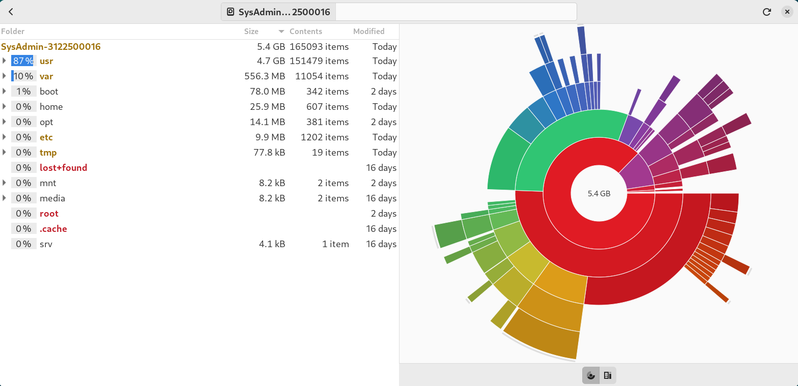

_Baobab: Analisis ruang disk pada Gnome_

### 2. Cleaning The Package
**Apt/aptitude/dpkg** adalah pengelola paket Debian. Ketika menginstall sebuah paket, file **archive- source/deb**-nya akan disimpan pada sistem di folder **/var/cache/apt/arsip/** untuk memungkinkan penginstalan ulang tanpa koneksi internet.
  sudo apt clean
  
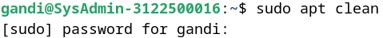

Setelah cache dari paket-paket yang terinstal dibersihkan, kita juga dapat menghapus paket-paket yang tidak berguna dari sistem dan juga file-file konfigurasi. Ingatlah untuk memeriksa dengan teliti daftar paket yang akan dihapus sebelum dijalankan.
  sudo apt autoremove –purge
  
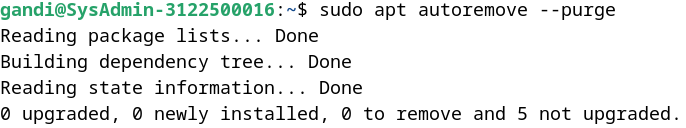

Jika telah mengupgrade sistem, ada kemungkinan beberapa paket tidak lagi tersedia pada repositori yang baru dikarenakan paket-paket tersebut sudah usang. Untuk membuat daftar dan menghapus paket-paket ini, gunakan apt dan ingatlah untuk memeriksa daftar paket yang akan dihapus.
  sudo apt list ‘?obsolete’
  sudo apt remove ‘?obsolete’
  
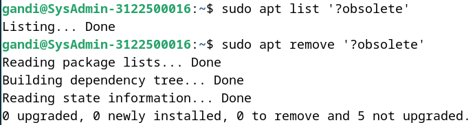

Terakhir, untuk membuat daftar dan membersihkan file konfigurasi yang tetap ada meskipun aplikasi telah dihapus.
  dpkg –list | awk ‘/^rc/ {print $2}’
  sudo apt purge $(dpkg –list | awk ‘/^rc/ {print $2}’)
  
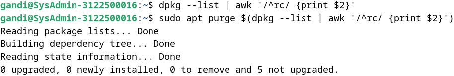

Kita dapat menginstal tool deborphan yang berisi daftar paket-paket yatim piatu (paket-paket yang tidak bergantung pada paket lain) pada sistem. Ingatlah untuk memeriksa dengan seksama daftar paket yang akan dihapus.
  sudo apt install deborphan, echo $(deborphan)
  sudo apt autoremove –purge $(deborphan)
  
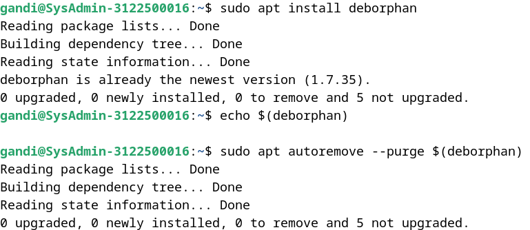

### 3. Emptying The Trash Bin
Tiga sampah yang berbeda dan harus dipertimbangkan:
#### a. Sampah Pengguna:
**~/.local/share/Trash/**. Kita dapat mengosongkannya dengan manajer file sistem atau terminal.
  rm -Rf  ~/.local/share/Trash/*

#### b. Sampah Administrator:
**/root/.local/share/Trash/**. Untuk mengosongkannya dengan cara yang benar, gunakan terminal dalam mode administrator.
  rm -Rf /root/.local/share/Trash/*

#### c. Sampah Eksternal:
terletak di disk eksternal dan biasanya bernama **'/media/y- our_id/your_disk/.Trash_1000'**, di mana your_id sesuai dengan nama login.

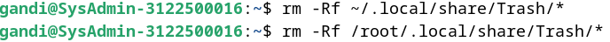

### 4. Purging Application Caches
Beberapa aplikasi yang menggunakan folder cache untuk menyimpan gambar, video, dan berbagai informasi lainnya agar dapat berjalan lebih cepat. Biasanya data ini tidak menghabiskan terlalu banyak ruang disk, namun jika kita mendeteksi bahwa sebuah folder menjadi terlalu besar, jangan ragu untuk menghapusnya.
   rm -Rf ~/.cache/*
   

Setiap aplikasi memiliki caranya sendiri untuk mengelola cache-nya. ada yang menghapusnya secara sistematis ketika ditutup, ada yang menyimpan datanya di folder /tmp, yang akan dihapus saat sesi logout, ada juga yang menyimpan semua informasinya di folder tertentu.

### 5. Purging The Thumbnails
Setiap kali membuka folder yang berisi gambar atau video, thumbnail dibuat untuk mewakili file grafis ini. Thumbnail ini disimpan dalam folder tertentu untuk digunakan kembali, daripada dipaksa untuk menghitung ulang setiap kali Anda mengakses file semacam ini. Masalahnya akan muncul ketika menghapus file grafis, karena thumbnail-nya disimpan dalam sistem, dan ini menyebabkan sejumlah ruang disk terbuang untuk menyimpan thumbnail yang sudah tidak terpakai. Untuk menghapusnya, cukup dengan menghapus folder yang bersangkutan.
   rm -Rf ~/.thumbnails
   

Folder ini akan dibuat lagi, pada saat sistem perlu menyimpan thumbnail yang baru dibuat.
