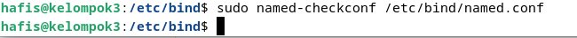
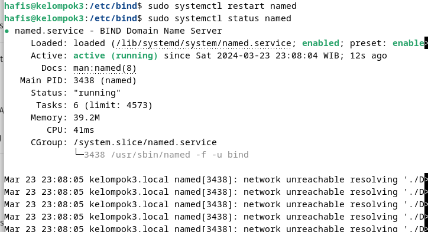
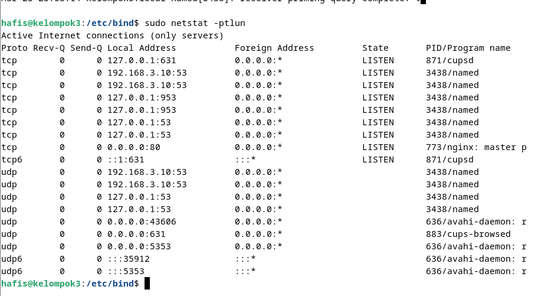
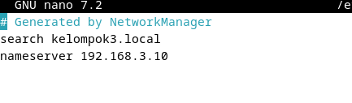
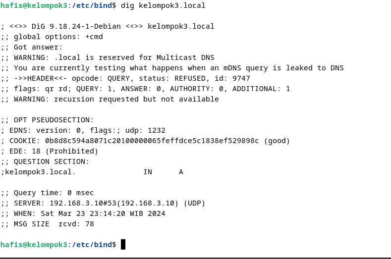
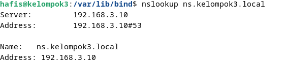

sudo apt install bind9 bind9-doc bind9-dnsutils 

Konfigurasi IP sesuai dengan kebutuhan di network interface
sample case saya : 192.168.3.10/24

1.  lakukan configurasi pada file /etc/bind/named.conf
buka file [named.conf](./named.conf) dan sesuaikan dengan kebutuhan
dengan command `sudo nano /etc/bind/named.conf` dan simpan dengan `ctrl + x` kemudian `y` dan `enter`

2. lakukan configurasi pada file /etc/bind/named.conf.local
buka file [named.conf.local](./named.conf.local) dan sesuaikan dengan kebutuhan
dengan command `sudo nano /etc/bind/named.conf.local` dan simpan dengan `ctrl + x` kemudian `y` dan `enter`

3. lakukan configurasi pada file /etc/bind/named.conf.options
buka file [named.conf.options](./named.conf.options) dan sesuaikan dengan kebutuhan
dengan command `sudo nano /etc/bind/named.conf.options` dan simpan dengan `ctrl + x` kemudian `y` dan `enter`

4.  lakukan pengecekan file konfigurasi dengan command `sudo named-checkconf /etc/bind/named.conf` dan pastikan tidak ada error seperti digambar berikut ini : 

5. buat file zone untuk domain yang akan di gunakan dengan command `sudo nano /var/lib/bind/db.kelompok3.local` lihat file [db.kelompok3.local](./db.kelompok3.local) dan sesuaikan dengan kebutuhan simpan dengan `ctrl + x` kemudian `y` dan `enter`

6. buat file reverse zone untuk domain yang akan di gunakan dengan command `sudo nano /var/lib/bind/db.kelompok3.inv` lihat file [db.kelompok3.inv](./db.kelompok3.inv) dan sesuaikan dengan kebutuhan simpan dengan `ctrl + x` kemudian `y` dan `enter`

7. lakukan restart service named dengan command `sudo systemctl restart bind9` dan cek status service dengan command `sudo systemctl status bind9` dan pastikan service berjalan dengan baik seperti gambar berikut ini : 

8. check apakah port 53 sudah terbuka dengan command `sudo netstat -ptuln` dan pastikan port 53 sudah terbuka seperti gambar berikut ini
9. configurasi file resolv.conf dengan command `sudo nano /etc/resolv.conf` dan tambahkan `nameserver server-ip` dan simpan dengan `ctrl + x` kemudian `y` dan `enter` seperti gambar berikut ini : 

10. lakukan pengecekan dengan command `dig kelompok3.local` dan pastikan hasilnya seperti gambar berikut ini  

11. lakukan pengecekan nslookup dengan command `nslookup kelompok3.local` dan pastikan hasilnya seperti gambar berikut ini  