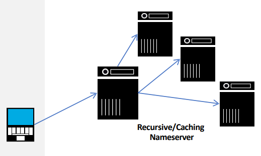

# Ekosistem Internet

     
    <em style="font-size:10px">Gambar 1. Ekosistem Internet</em>

 

Ekosistem Internet merupakan istilah untuk menggambarkan organisasi dan komunitas yang memimpin operasi serta pengembangan teknologi dan infrastruktur internet global. Hal ini melibatkan berbagai aktor dengan kepemilikan dan kontrol yang tersebar untuk mendukung perkembangan teknologi internet yang cepat dan berkelanjutan.
  
Oraganisasi yang membentuk Ekosistem Internet:

- Badan-badan standar teknis seperti <strong>Internet Engineering Task Force (IETF)</strong> dan <strong>World Wide Web Consortium (W3C)</strong>.
- Organisasi yang mengelola sumber daya untuk pengalamatan global seperti <strong>Internet Corporation for Assigned Names and Numbers (ICANN)</strong>, termasuk pengoperasian fungsi <strong>Internet Assigned Numbers Authority (IANA)</strong>, <strong>Regional Internet Registries (RIR)</strong>, dan <strong>Doman Name Registries and Registrars</strong>.
- Perusahaan yang menyediakan layanan infrastruktur jaringan seperti penyedia <strong>Domain Name Service (DNS)</strong>, <strong>providers</strong>, dan <strong>Internet Exchange Point (IXP)</strong>.
- Individu dan Organisasi yang menggunakan Internet untuk berkomunikasi satu sama lain dan menawarkan layanan.
- Organisasi yang menyediakan pendidikan dan membangun kapasitas untuk mengembangkan dan menggunakan teknologi Internet, seperti organisasi multilateral, lembaga pendidikan, dan lembaga pemerintah

---

## Internet

     
    <em style="font-size:10px">Gambar 2. Internet</em>

 

Gambar diatas menjunjukkan diagram jaringan komputter yang terdiri dari berbagai kompeonen untuk menghubungkan dan memungkinkan komunikasi antar komputer. Komponen-komponen tersebut diantaranya Server, Komputer, Router, Switch, Modem: Mengubah sinyal analog dari saluran telepon menjadi sinyal digital yang dapat digunakan oleh komputer dan Kabel. Secara teknis internet sebagai routing system dan naming system. Sedangkan secara arsitektur, internet sebagai standarisasi, penyedia layanan, intenet register dan clearing house.

---

## IP Addressing & Routing System

#### a. Routing

     
    <em style="font-size:10px">Gambar 3. a) Routing</em>

 

Adanya alamat yang mengarah ke situs web diikuti dengan data yang akan ditransfer. Kebijakan merupakan kunci untuk memahami tingkat <em>AS (Overlay Network)</em>. <strong>BGP (Border Gateway Protocol)</strong> mengatur kebijakan yang terdistribusi dengan jenis penyedia untuk memaksimalkan pendapatan dan memininalkan biaya.

#### b. Peering Connections

     
    <em style="font-size:10px">b) Peering Connections</em>

 

Untuk memahami kebijakan ini membutuhkan pemangaman mengenai peering models yang mencakup provider atau customer, transit dan settlement free.

#### c. Edge Provider Routing Policy

     
    <em style="font-size:10px">c) Edge Provider Routing Policy</em>

 

Jadilah jalur yang dipilih oleh pelanggan yang terhubung. Pilih jalur lalu lintas yang paling pendek dengan waktu sesingkat mungkin, ini dikenal sebagai <em>hot potato routing</em>.

#### d. Transit Provider Routing Policy

     
    <em style="font-size:10px"> d) Transit Provider Routing Policy</em>

 

Meningkatkan peering untuk mempersingkat jalur AS dan membawa sebanyak mungkin lalu lintas dengan jarak sesingkat mungkin, ini dikenal sebagai <em>hot potato routing</em>.

#### e. Content Provider Routing Policy

Mengirimkan konten secepat mungkin dengan menyebarkan peer sebanyak mungkin menggunakan distribusi konten ke setiap sudut jaringan dan mengangkut lalu lintas melalui link internal untuk kontrol pengalaman pengguna yang optimal. Hal ini dikenal sebagai <em>cold potato routing</em>.

---

## Naming System

     
    <em style="font-size:10px">Gambar 4. Naming System</em>

 

Gambar diatas menunjukkan cara kerja DNS dalam jaringan. ICANN akan mengkoordinasikan system penamaan internet dan Registries akan mengelola <strong>Top Level Domain (TLD)</strong> seperti <em>.com, .org</em> dan <em>.id</em>. Pada bagian Registries menyediakan layanan DNS kepada registrar yang menjual nama domain kepada pengguna. Kemudian DNS yang akan menerjemahkan nama domain ke alamat IP, ini dikenal sebagai <em>Name to location mapping</em>.

---

## Domain Name System (DNS)

     
    <em style="font-size:10px">Gambar 5. Domain Name System (DNS)</em>

 

#### a. DNS Hierarchy Tree

     
    <em style="font-size:10px">Gambar 5. a) DNS Hierarchy Tree</em>

 

DNS Hierarchy Tree adalah struktur yang mencakup semua domain di Internet dalam lima level. Dimulai dari Root Level Domain sebagai level teratas yaitu TLD. Kemudian, ada <strong>Second Level Domains (SLD)</strong>, serta Subdomains. Level terakhir adalah Hosts, yang merupakan segmen paling spesifik seperti example.com. Dengan struktur ini, pengguna dapat mengakses situs web menggunakan nama domain tanpa perlu mengingat alamat IP yang rumit.

#### b.	DNS Components

     
    <em style="font-size:10px">b) DNS Components</em>

 

DNS memudahkan konversi antara nama domain dan alamat IP. Ini terdiri dari beberapa komponen penting, yaitu Namespace (daftar lengkap domain), Nameserver (server penyimpan informasi domain), Resolver (program yang mengirim permintaan DNS) dan Client (komputer yang mengirim permintaan DNS ke resolver).

#### c.	Domains

     
    <em style="font-size:10px">c) Domains</em>

 

Server root sebagai pusat pengelolaan semua domain di internet, di bawahnya terdapat contoh domain tingkat atas seperti .id dan .com, serta domain tingkat kedua seperti .co.id dan .ac.id. Contoh domain juga mencakup subdomain seperti www.pens.ac.id untuk web pendidikan, www.detik.com dan www.kompas.com untuk web berita. Bagian bawah gambar menekankan penggunaan domain untuk situs web dan subdomain untuk layanan email.

#### d.	Name Server

     
    <em style="font-size:10px">d) Name Server</em>

 

Nameserver merupakan bagian penting dalam sistem DNS yang menangani pertanyaan-pertanyaan terkait DNS. Jenis-jenisnya meliputi authoritative servers, terdiri dari Primary dan Secondary, serta recursive servers yang dapat berperan sebagai caching forwarders. Fungsi-fungsi ini sering kali saling terintegrasi dalam satu name server.

#### e.	Authoritative Nameserver

     
    <em style="font-size:10px">e) Authoritative Nameserver</em>

 

Nameserver yang diotorisasi untuk memberikan jawaban untuk suatu domain (bisa lebih dari satu). Berdasarkan metode manajemen terbagi menjadi Primary dan Secondary. Primary nameserver menerima semua perubahan pada zona dilakukan, sementara secondary nameserver mengambil file zona dari primary secara berkala.

#### f.	Recursive Nameserver

     
    <em style="font-size:10px">f) Recursive Nameserver</em>

 

Recursive nameserver berfungsi untuk mencari authoritative nameserver dan mendapatkan jawaban, serta berfungsi sebagai caching servers yang memprioritaskan cache lokal untuk mengurangi latensi dan lalu lintas ke link eksternal. Proses ini bersifat iteratif, dimulai dari root.

#### g.	Root Servers

Puncak hierarki DNS terdiri dari 13 server root nama yang dioperasikan di seluruh dunia, yang ditandai dengan:

    [a-m].root-servers.net. 

Ada lebih dari 13 server fisik yang mewakili root name servers, dimana setiap root server memiliki instansi yang dideploy melalui anycast.

#### h.	Root Server Deployment at APNIC

Pada tahun 2002, APNIC mendirikan situs-situs server root baru di wilayah AP untuk memperkuat DNS dengan mendeploy sumber daya tambahan yang menangani pertumbuhan lalu lintas internet yang meningkat.

#### i.	Resource Records

     
    <em style="font-size:10px">i) Resource Records</em>

 

File zona DNS adalah file yang memuat informasi mengenai konten suatu situs web. Contohnya, untuk subdomain <em>training.apnic.net</em>, TTL diatur pada 86400 detik, artinya data akan disimpan dalam cache DNS selama periode tersebut sebelum perlu diperbarui. Kelas DNS diatur sebagai IN yang berarti ini adalah kelas DNS internet. Tipe record adalah A, menandakan bahwa data tersebut adalah alamat IPv4. <strong>RDATA (Resource Data)</strong> berisi alamat IP terkait dengan subdomain tersebut, yakni 192.168.1.100.

#### j.	Common Resource Record Types

     
    <em style="font-size:10px">j) Common Resource Record Types</em>

#### k.	Example: RRs in a Zone File

     
    <em style="font-size:10px">k) Example: RRs in a Zone File</em>

 

Zone file merupakan sebuah file teks yang memetakan nama domain ke alamat IP. RR dalam file zona memiliki beberapa bidang yang berbeda.

- SOA (Start of Authority) untuk domain apnic.net. yang mengarah ke server nama utama ns.apnic.net. dan administrator admin.apnic.net.
- NS (Name Server) yang menunjuk ke server nama ns.apnic.net. dan ns.ripe.net. untuk menyelesaikan nama domain apnic.net.
- A (Address) yang memetakan nama domain www.apnic.net. ke alamat IP 192.168.0.2.

#### l.	DNS Data Flow

     
    <em style="font-size:10px">l) DNS Data Flow</em>

 

Administrator zona bertanggung jawab untuk membuat atau memperbarui file zona di server master. Setiap perubahan yang terjadi pada file zona disinkronkan ke server slave. Ketika pengguna memasukkan nama domain ke browser web, resolver mereka mengirimkan permintaan ke server DNS. Server DNS kemudian memeriksa file zonanya untuk menemukan catatan sumber daya yang sesuai dengan nama domain yang diminta. Setelah menemukan RR yang cocok, server DNS mengembalikan alamat IP yang terkait dengan nama domain tersebut ke resolver. Selanjutnya, resolver menggunakan alamat IP untuk terhubung ke server web yang sesuai.

#### m.	Delegating a Zone

     
    <em style="font-size:10px">m) Delegating a Zone</em>

 

Delegasi zona dilakukan dengan menambahkan catatan NS untuk menunjukkan nameserver yang bertanggung jawab atas subdomain tertentu. Dalam contoh ini, zona apnic.net mendelegerikan subdomain academy.apnic.net ke dua nameserver, yaitu ns1.academy.apnic.net dan ns2.academy.apnic.net. Untuk mengakses subdomain tersebut, klien harus mengarahkan permintaannya ke salah satu nameserver tersebut. Untuk mencapai nameserver ns1 dan ns2, diperlukan penambahan Glue Record.

#### n.	Glue Record

     
    <em style="font-size:10px">n) Glue Record</em>

 

Glue record adalah data non-authoritative yang merupakan sebuah catatan A yang memetakan alamat dari nameserver sub-domain.

---

## Standards Bodies

     
    <em style="font-size:10px">Gambar 6. Standards Organizations</em>

 

- IETF
Semua protokol transportasi dan routing layer 3, termasuk IP, TCP, UDP, HTTP, DNS, protokol routing, telnet, rsync, IPsec, dan protokol manajemen jaringan. IETF memiliki beberapa area fokus yang berbeda. Area Umum (gen), Keamanan (sec), Aplikasi dan Real Time (art), Operasi dan Manajemen Internet (ops), Layanan Transportasi (tsv), Routing (rtg), dan Internet (int). Setiap area bertanggung jawab atas aspek tertentu dalam pengembangan standar IETF.  

- IEEE
Semua protokol transportasi dan kontrol plane di layer 1 dan layer 2, termasuk Ethernet, spanning tree, dan jaringan nirkabel.  

- W3C
Bahasa markup (bahasa yang menjelaskan cara menampilkan atau merender konten), termasuk HTML dan XML.  

- ITU
Standar internasional apa pun, termasuk penomoran, skema enkripsi, dan protokol routing (seperti IS-IS).

---

## Service Providers

#### a. Content Provider Overview

Penyedia konten terbagi menjadi dua: yang menciptakan dan mendistribusikan media, serta yang menghubungkan pembeli dan penjual dalam e-commerce. Tujuan utama mereka adalah menarik perhatian pengguna, terutama untuk keperluan periklanan.

#### b. Access Provider Overview

Memberikan koneksi internet kepada pengguna, bisnis, dan organisasi serta terlibat dalam pembuatan dan distribusi konten.

#### c. Transit Provider overview

     
    <em style="font-size:10px">Gambar 7. a) Transit Provider overview</em>

 

Menghubungkan penyedia konten dengan penyedia layanan akses untuk memastikan akses yang lancar dan efisien bagi pengguna. Ini memungkinkan konten untuk diakses dengan mudah melalui jaringan yang disediakan oleh penyedia akses. Dengan menjembatani keduanya, pengguna dapat dengan cepat mengakses berbagai layanan dan konten online tanpa hambatan.

#### d. Internet Exchange Point Overview

     
    <em style="font-size:10px">b) Internet Exchange Point Overview</em>

 

Internet Exchange Points (IXPs) adalah tempat pertukaran data lokal yang memungkinkan penyedia akses dan penyedia konten untuk terhubung secara langsung. IXPs bisa bersifat komersial atau non-profit dan digunakan oleh penyedia layanan dalam suatu wilayah. Dengan menggunakan IXPs, penyedia layanan dapat menghindari penggunaan penyedia transit di luar wilayah, sehingga mengurangi latensi dalam wilayah tersebut. Selain itu, IXPs menggantikan biaya penyelesaian berbasis lalu lintas dengan biaya keanggotaan tetap.

---

## Registries

#### a. Naming Authorities

ICANN dan IANA mengoordinasikan penugasan angka dan nama yang mendukung fungsi Internet serta menetapkan aturan bagi organisasi lain untuk memperoleh sumber daya tersebut.

#### b. Regional Registry Overview

     
    <em style="font-size:10px">Gambar 8. Regional Registry Overview</em>

 

Regional Internet Registries (RIRs) mengelola penugasan blok alamat IP untuk wilayah tertentu, serta terlibat dalam penelitian, standarisasi, dan menyediakan layanan penting seperti whois. IANA memberikan blok alamat IP kepada setiap RIR berdasarkan kebutuhan, yang kemudian diteruskan ke anggotanya untuk penggunaan dalam tabel routing global, entri DNS atau jaringan internal.

#### c. Top Level Registries

Domain Name Registries mengelola TLDs atas izin ICANN. Mereka menjual nama domain kepada registri tingkat kedua, termasuk ccTLDs yang merepresentasikan negara atau wilayah geografis.

#### d. Second Tier Registries

Domain resellers membeli domain dari registrar TLD dengan harga tetap dan kemudian menjualnya berdasarkan popularitas, bundel dengan layanan lain, dan sebagainya.

---

## Other Entities

#### a. Clearing House

NOGs dan asosiasi lainnya bertindak sebagai pusat pengelolaan operasional, sedangkan IRRs bertindak sebagai pusat pengelolaan kebijakan dan status jaringan. Para penyedia konten menciptakan konten dan mendistribusikannya melalui jaringan distribusi konten.

#### b. Internet Route Registries

Internet Routing Registries (IRRs) adalah basis data yang dikembangkan secara kolaboratif dan sering dijalankan oleh relawan, seperti registrar dan lembaga riset. Beberapa organisasi seperti RIPE, APNIC, ARIN, EasyNet, dan Level3 menyediakan salinan IRR. Data disimpan dalam format standar yang disebut Routing Policy Specification Language (RPSL), yang digunakan oleh penyedia layanan untuk membangun filter rute dan menentukan kebijakan jaringan.

#### c. Network Operators Groups

Network Operator's Groups (NOGs) adalah pusat informasi untuk operasi jaringan. Biasanya, mereka adalah organisasi relawan yang bekerja dengan registrar regional, lembaga riset, vendor, dan organisasi regional lainnya.
