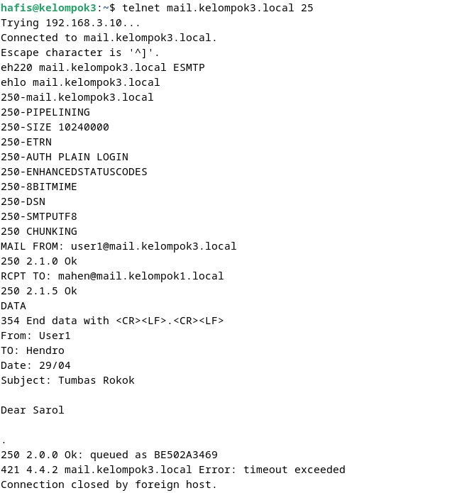
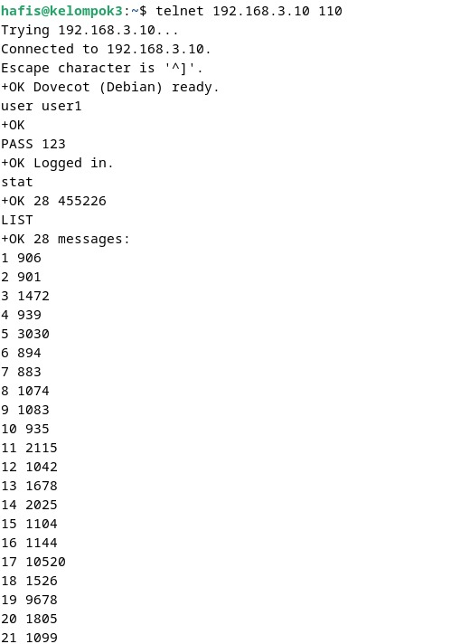
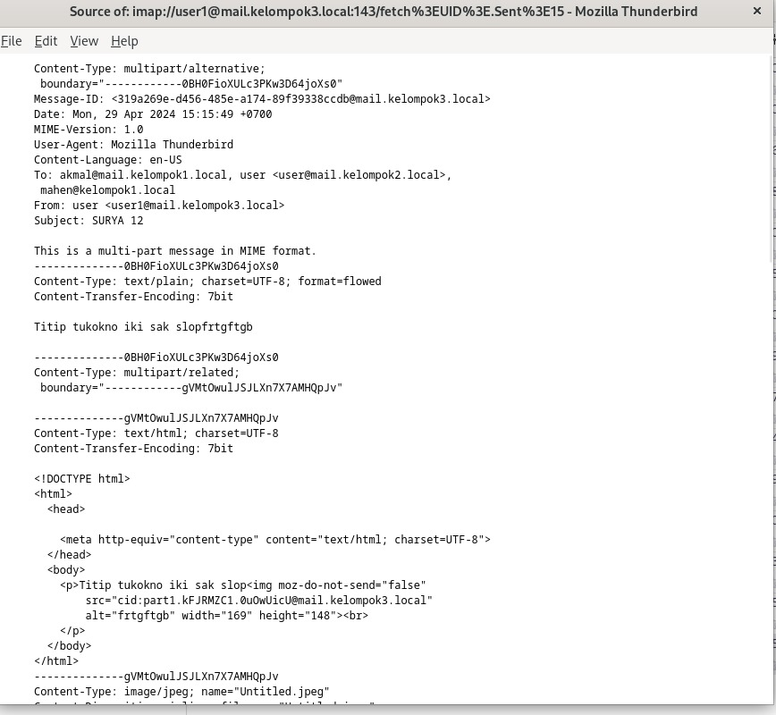
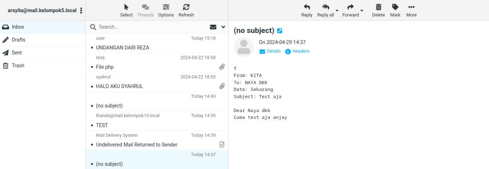
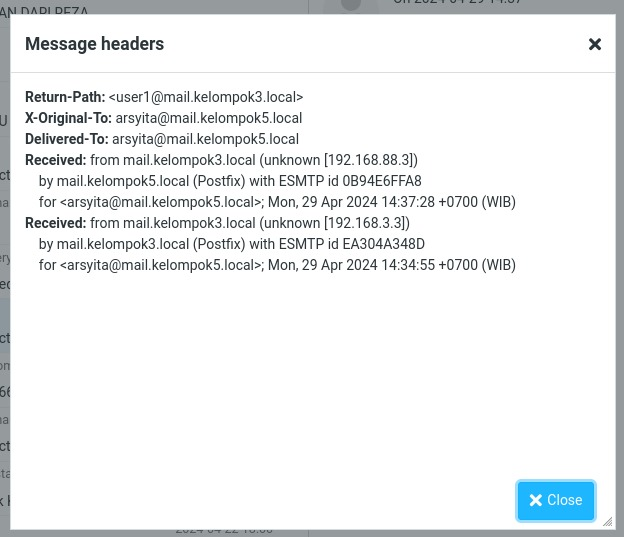

# SMTP-POP-IMAP-MIME

## 1. Message Transfer Agent (MTA)

MTA adalah software yang bertugas mengirimkan email dari satu server ke server lainnya. </br>
Contoh MTA: Postfix, Sendmail, Exim, Qmail, dll. </br>
SMTP (Simple Mail Transfer Protocol) adalah protokol yang digunakan oleh MTA untuk mengirimkan email.
- SMTP menggunakan port 25. SMTP menggunakan dua jenis protokol: 
  1. SMTPS (SMTP Secure) 
     1. SMTPS menggunakan port 465
     2. SMTPS menggunakan SSL/TLS untuk enkripsi
  2. STARTTLS 
     1. STARTTLS menggunakan port 587
     2. STARTTLS menggunakan TLS untuk enkripsi
- SMTPS dan STARTTLS digunakan untuk mengamankan koneksi antara MTA dan MUA.

### Percobaan Interaksi dengan server SMTP



1. Buka terminal dan jalankan perintah berikut:
   ```bash
   telnet telnet mail.kelompok3.local 25
   ```
   Perintah berikut untuk membuka koneksi ke server SMTP dengan nama host ```mail.kelompok3.local``` pada port 25.


2. Mengautentikasi diri ke server SMTP.
   ```bash
   HELO mail.kelompok3.local
   ```
   Perintah di atas akan memberitahu server SMTP bahwa kita adalah client yang terhubung ke server SMTP. Server akan menampilkan pesan balasan yang berisi informasi tentang server.


3. Menentukan alamat pengirim email.
   ```bash
   MAIL FROM: user1@mail.kelompok3.local
   ```
   Ini adalah perintah untuk menentukan alamat pengirim dari mana email akan dikirim. Dalam hal ini, alamat pengirimnya adalah ```user1@mail.kelompok3.local```.


4. Memasukkan alamat penerima email.
   ```bash
   RCPT TO: mahen@mail.kelompok1.local
   ```
   Perintah ini digunakan untuk menentukan alamat penerima email. Dalam hal ini, alamat penerima adalah ```mahen@mail.kelompok1.local```.


5. Memulai pengiriman email.
   ```bash
   DATA
   ```
   Perintah ini digunakan untuk memulai pengiriman email. Setelah mengetikkan perintah ini, kita bisa menulis isi email.


6. Ketikkan perintah berikut:
   ```bash
   From: User1
   To: Hendro
   Date: 29/04
   Subject: Tumbas Rokok
   Dear Sarol
   .
   ```
   Perintah di atas adalah isi email yang akan dikirim. Setelah mengetikkan isi email. </br>
   1. From adalah header email yang berisi alamat pengirim.
   2. To adalah header email yang berisi alamat penerima.
   3. Date adalah header email yang berisi tanggal email dikirim.
   3. Subject adalah header email yang berisi judul email.
   4. ```Dear Sarol```, ini adalah email percobaan adalah isi email.
   Jangan lupa untuk mengetikkan titik (.) untuk mengakhiri pengiriman email.
   

7. Mengakhiri sesi telnet.
   ```bash
   QUIT
   ```
   Perintah ini digunakan untuk keluar dari sesi telnet.


## 2. Message Access Agent (MAA)

MAA adalah software yang bertugas untuk mengakses email dari server. </br>
Contoh MAA: POP3, IMAP. </br>
POP3 (Post Office Protocol 3) adalah protokol yang digunakan untuk mengakses email dari server.
POP3 memiliki beberapa karakteristik:
  - POP3 menggunakan port 110.
  - POP3 menggunakan protokol TCP.
  - POP3 menghapus email dari server setelah diunduh.
  - POP3 tidak mendukung folder.
  - POP3 tidak mendukung sinkronisasi.
  - POP3 tidak mendukung akses email dari beberapa perangkat.
  - POP3 tidak mendukung akses email secara offline.
  - POP3 tidak mendukung akses email dari web.

IMAP (Internet Message Access Protocol) adalah protokol yang digunakan untuk mengakses email dari server.
IMAP memiliki beberapa karakteristik:
  - IMAP menggunakan port 143.
  - IMAP menggunakan protokol TCP.
  - IMAP tidak menghapus email dari server setelah diunduh.
  - IMAP mendukung folder.
  - IMAP mendukung sinkronisasi.
  - IMAP mendukung akses email dari beberapa perangkat.
  - IMAP mendukung akses email secara offline.
  - IMAP mendukung akses email dari web.

### Percobaan Interaksi dengan server POP3



1. Buka terminal dan jalankan perintah berikut:
   ```bash
   telnet mail.kelompok3.local 110
   ```
   Perintah berikut untuk membuka koneksi ke server POP3 dengan nama host ```mail.kelompok3.local``` pada port 110.


2. Mengautentikasi diri ke server POP3.
   ```bash
   user user1
    ```
    Perintah di atas digunakan untuk memberitahu atau mengautentikasi diri ke server POP3 bahwa kita adalah user yang akan mengakses email.


3. Mengambil email dari server POP3.
   ```bash
   stat
   ```
   Ini adalah perintah untuk menampilkan status kotak surat (mailbox) pengguna. Perintah tersebut dapat menampilkan jumlah email yang ada di server POP3.


4. Melihat daftar email yang ada di server POP3.
   ```bash
   list
   ```
   Perintah di atas digunakan untuk menampilkan daftar email yang ada di server POP3.


5.  Menampilkan isi email yang ada di server POP3.
    ```bash
    RETR 7
    ```
    Perintah di atas digunakan untuk menampilkan isi email yang ada di server POP3. Dalam hal ini, email yang akan ditampilkan adalah email ketujuh. Nomor email yang diambil dapat bervariasi tergantung pada email mana yang ingin diambil.


## Analisis MIME

MIME (Multipurpose Internet Mail Extensions) adalah standar yang digunakan untuk mengirimkan email dengan format teks, gambar, audio, video, dan aplikasi lainnya. 
MIME juga memungkinkan email untuk menyertakan header tambahan yang memberikan informasi tentang jenis dan format konten yang dikirimkan, sehingga klien email penerima dapat menafsirkan dan menampilkan konten dengan benar. Ini berarti, misalnya, jika kita mengirim email yang berisi gambar, MIME akan memberikan informasi kepada klien email bahwa konten tersebut adalah gambar.</br>
Karakteristik MIME adalah MIME memungkinkan pengguna untuk:
- Mengirim email dengan lampiran.
- Mengirim email dengan format HTML.
- Mengirim email dengan format teks biasa.
- Mengirim email dengan format gambar.
- Mengirim email dengan format audio.
- Mengirim email dengan format video.
- Mengirim email dengan format aplikasi.
- Mengirim email dengan format teks terstruktur.

### Percobaan MIME



- Pada percobaan sebelumnya kelompok kami sudah mencoba mengirimkan email dengan gambar kepada email lain.
- Email yang kami tuju adalah kepada 
  - Kelompok 1 : ```akmal@mail.kelompok1.local``` dan ```mahen@mail.kelompok1.local``` 
  - Kelompok 2 : ```user@mail.kelompok2.local```
- Email yang kami kirimkan berisi gambar yang kami lampirkan yaitu gambar Surya 12.
- Email yang kami kirimkan berhasil diterima oleh email yang kami tuju.
- Dalam gambar terlihat ada Content-Type. Dimana Content-Type merupakan header email yang berisi jenis konten yang dikirimkan, yaitu multipart/mixed. Multipart/mixed adalah jenis konten yang digunakan untuk mengirimkan email dengan lampiran. 
- Dalam gambar terlihat ada MIME-Version. Dimana MIME-Version merupakan header email yang berisi versi MIME yang digunakan, yaitu 1.0.


### Testing Email Terkirim



- Saat kami mengirimkan email dengan server SMTP, email kami berhasil terkirim ke email yang kami tuju.
- Salah satu dari banyak email yang kami tuju adalah ```arsyita@mail.kelompok5.local```
- Email yang kami kirimkan berisi text saja hasil percobaan dengan menggunakan telnet SMTP.

Berikut adalah Header Email yang terkirim kepada Kelompok 5:




