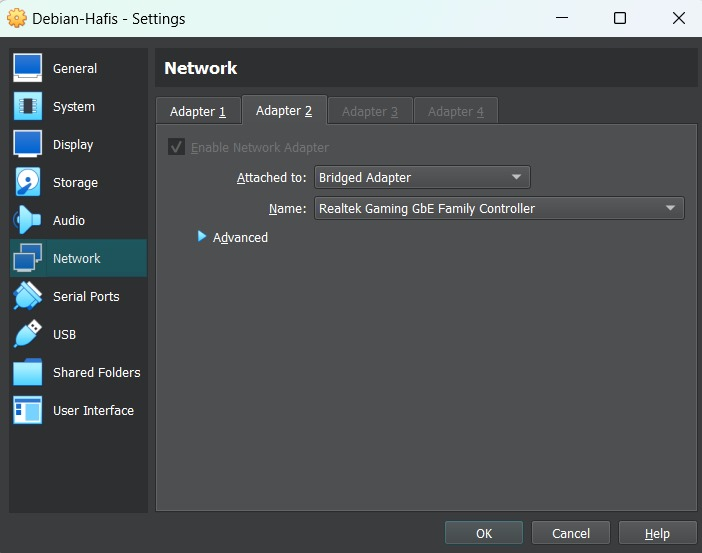
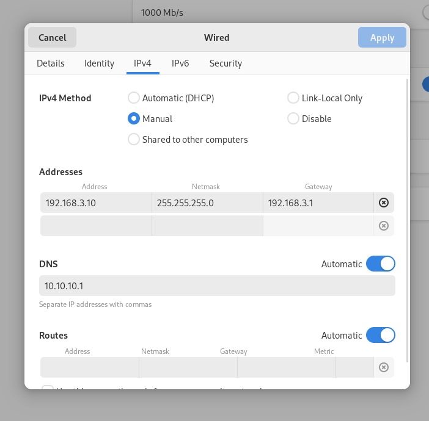
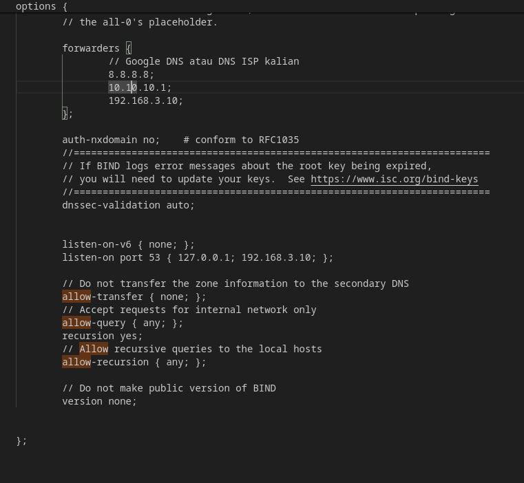
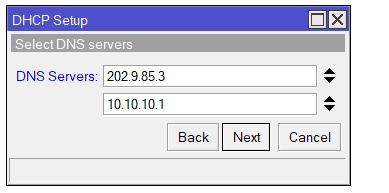
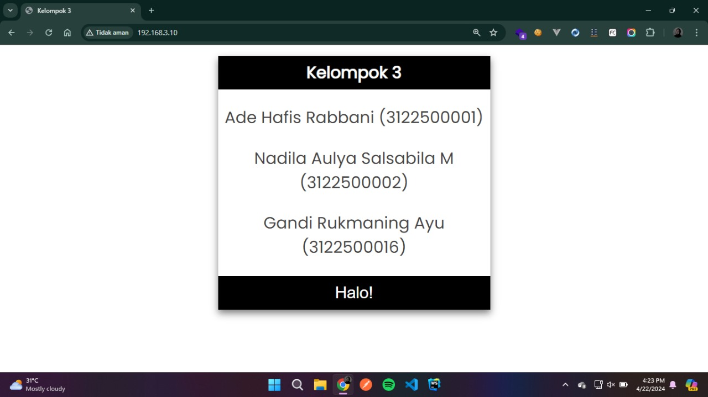
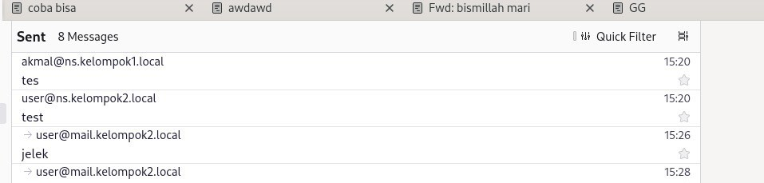
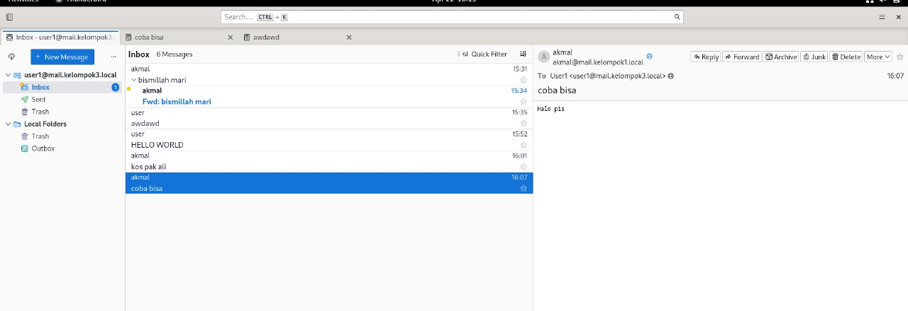

## 1. Mengubah Interface
Ubah interface jaringan VM menjadi ```Bridge Adapter```



## 2. Menambahkan DNS
Untuk pengaturan IPv4 method pilih Manual, kemudian pada bagian DNS ubah menjadi ```10.10.10.1```


## 3. Forwarder dan Allow-query
Menambahkan forwarder dan merubah allow-query  dan allow-recursion menjadi ```any``` pada file named.conf.options
```sudo nano /etc/bind/named.conf.options```.


## 4. Merubah DNS
Merubah DNS Servers di mikrotik menjadi ```10.10.10.1```



## 5. Testing
- Pengujian Web Server melalui client.
  

- Mencoba mengirim email ke alamat email lain.
  

- Melakukan pengecekan apakah dapat menerima email dari alamat lain.
  