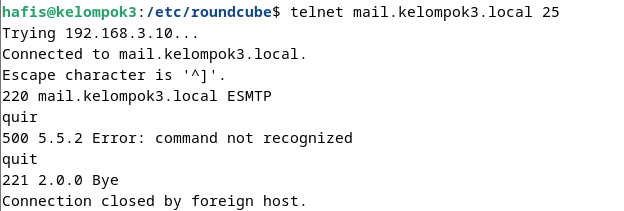

# Install Mail Server

## 1. Install Postfix
```apt -y install postfix sasl2-bin```
- Pilih no configuration

## 2. copy file main.cf
```cp /etc/postfix/main.cf /etc/postfix/main.cf.bak```

## 3. Edit file main.cf
```code /etc/postfix/main.cf```

Lakukan perubahan pada file main.cf seperti berikut:
-   uncomment baris 82 
-   uncomment baris 98 dan ubah ```myhostname = mail.kelompok3.local```
-   uncomment baris 106 dan ubah ```mydomain = kelompok3.local```
-   uncomment baris 127
-   uncomment barus 141
-   uncomment baris 189
-   uncomment baris 232
-   uncomment baris 277
-   uncomment baris 294 dan ubah sesuai network yang digunakan ex : ```mynetworks = 127.0.0.0/8, 10.0.0.0/24, 192.168.0.0/24```
-   uncomment baris 416
-   uncomment baris 427
-   uncomment baris 449 dan ubah ```home_mailbox = Maildir/```
-   comment baris 585 dan tambahkan baris ```smtpd_banner = $myhostname ESMTP```
-   tambahkan di baris 659 ```sendmail_path = /usr/sbin/postfix```
-   tambahkan di baris 664 ```newaliases_path = /usr/bin/newaliases```
-   tambahkan di baris 669 ```mailq_path = /usr/bin/mailq```
-   tambahkan di baris 675 ```setgid_group = postdrop```
-   comment di baris 679
-   comment di baris 688
-   comment di baris 692
-   tambahkan di baris paling bawah 
    ```# add follows to the end
    # disable SMTP VRFY command
    disable_vrfy_command = yes
    # require HELO command to sender hosts
    smtpd_helo_required = yes
    # limit an email size
    # example below means 10M bytes limit
    message_size_limit = 10240000
    # SMTP-Auth settings
    smtpd_sasl_type = dovecot
    smtpd_sasl_path = private/auth
    smtpd_sasl_auth_enable = yes
    smtpd_sasl_security_options = noanonymous
    smtpd_sasl_local_domain = $myhostname
    smtpd_recipient_restrictions = permit_mynetworks, permit_auth_destination,permit_sasl_authenticated, reject
    ```
## 4. Perbarui database aliases postfix 
digunakan untuk memperbarui basis data alias alamat email dalam sistem. Dalam sistem pengiriman email pada Unix dan Linux, file aliases digunakan untuk menentukan alamat mana yang harus dikirimkan ke mana. Perintah newaliases digunakan untuk memperbarui file aliases.db setelah mengubah atau menambahkan entri dalam file aliases.

```sudo newaliases```

## 5. Restart postfix
```systemctl restart postfix```

## 6. Menambahkan konfigurasi anti spam
buka file main.cf
```code /etc/postfix/main.cf```

tambahkan baris berikut di paling bawah
```
# reject unknown clients that forward lookup and reverse lookup of their hostnames on DNS do not match
smtpd_client_restrictions = permit_mynetworks, reject_unknown_client_hostname, permit

# rejects senders that domain name set in FROM are not registered in DNS or
# not registered with FQDN
smtpd_sender_restrictions = permit_mynetworks, reject_unknown_sender_domain,reject_non_fqdn_sender

# reject hosts that domain name set in FROM are not registered in DNS or
# not registered with FQDN when your SMTP server receives HELO command
smtpd_helo_restrictions = permit_mynetworks, reject_unknown_hostname,reject_non_fqdn_hostname, reject_invalid_hostname, permit
```

restart postfix
```systemctl restart postfix```

## 7. Install Dovecot
```sudo apt -y install dovecot-core dovecot-pop3d dovecot-imapd```

## 8. Konfigurasi Dovecot
- Edit file /etc/dovecot/dovecot.conf
    ```sudo nano /etc/dovecot/dovecot.conf```
    uncomment baris 30

    

- Edit file /etc/dovecot/conf.d/10-auth.conf
    ```sudo nano /etc/dovecot/conf.d/10-auth.conf```
    uncomment baris 10 dan setting ke ```no```

    ubah di baris 100 menjadi ```disable_plaintext_auth = plain login```

    
    

- Edit file  /etc/dovecot/conf.d/10-mail.conf
  ```sudo nano /etc/dovecot/conf.d/10-mail.conf```
    uncomment baris 30 dan ubah menjadi ```mail_location = maildir:~/Maildir```

    

- Edit file /etc/dovecot/conf.d/10-master.conf
    ```sudo nano /etc/dovecot/conf.d/10-master.conf```
    uncomment baris 107-109
    dan ubah seperti berikut
    ```
    unix_listener /var/spool/postfix/private/auth {
        mode = 0666
        user = postfix
        group = postfix
    }
    ```

    

## 9. Restart Dovecot
```systemctl restart dovecot```

## 10. Final Check
``` netstat -a| grep LISTEN```
Pastikan Service MariaDB(MySQL), IMAP, POP3, DNS(domain), IMAPS, POP3S, SSH, Postfix (SMTP)

## 11. Testing
``` telnet mail.kelompok3.local 22 ``` (gunakan port yang sesuai dengan port ssh yang dibuka)
    