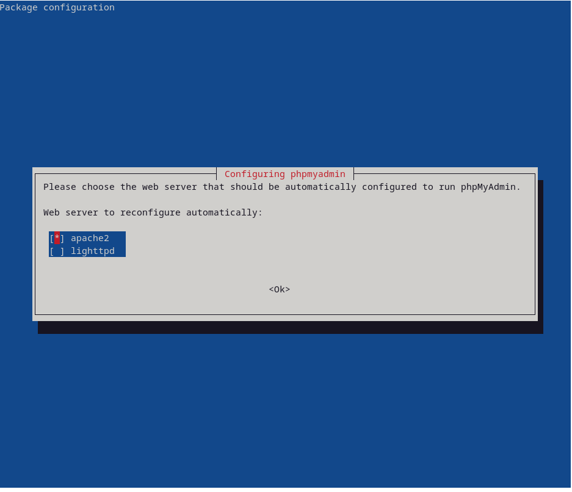
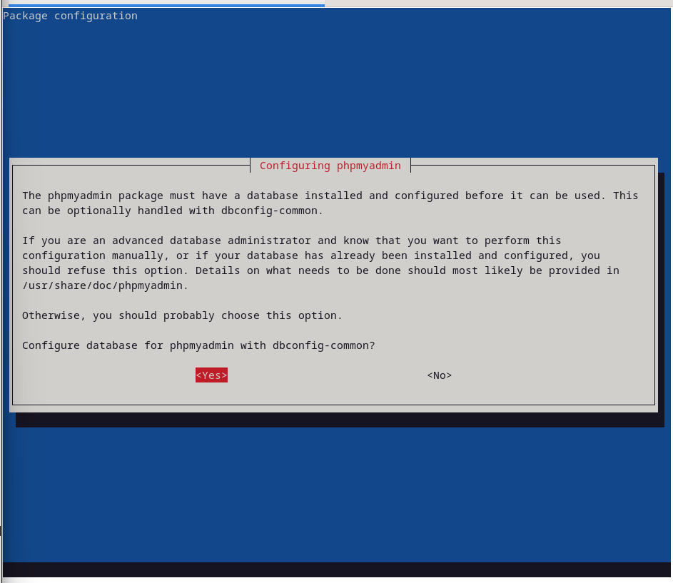
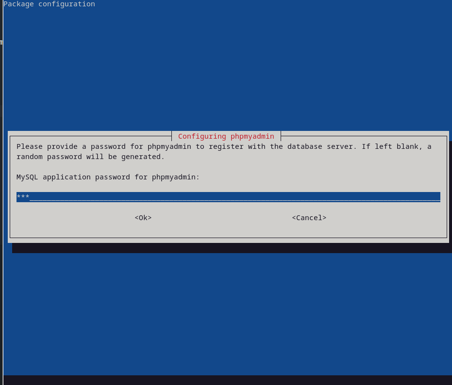
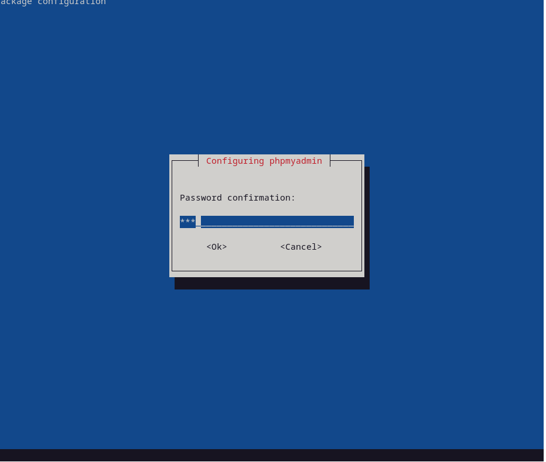
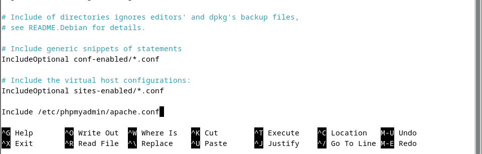
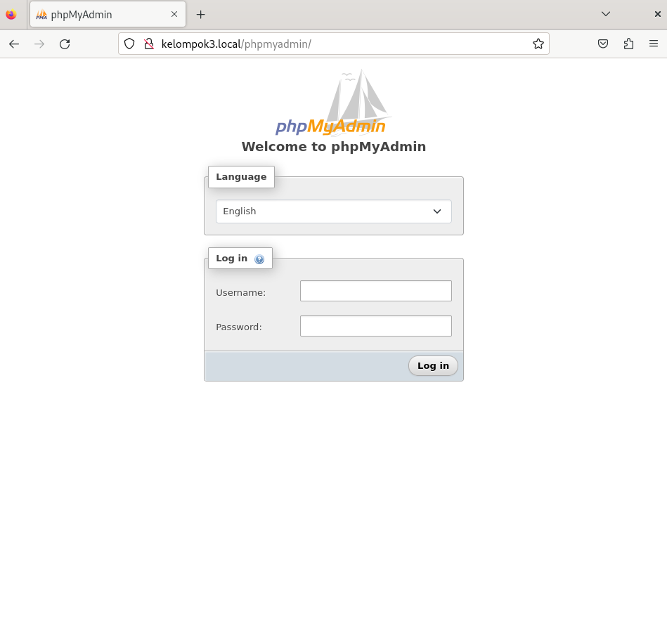
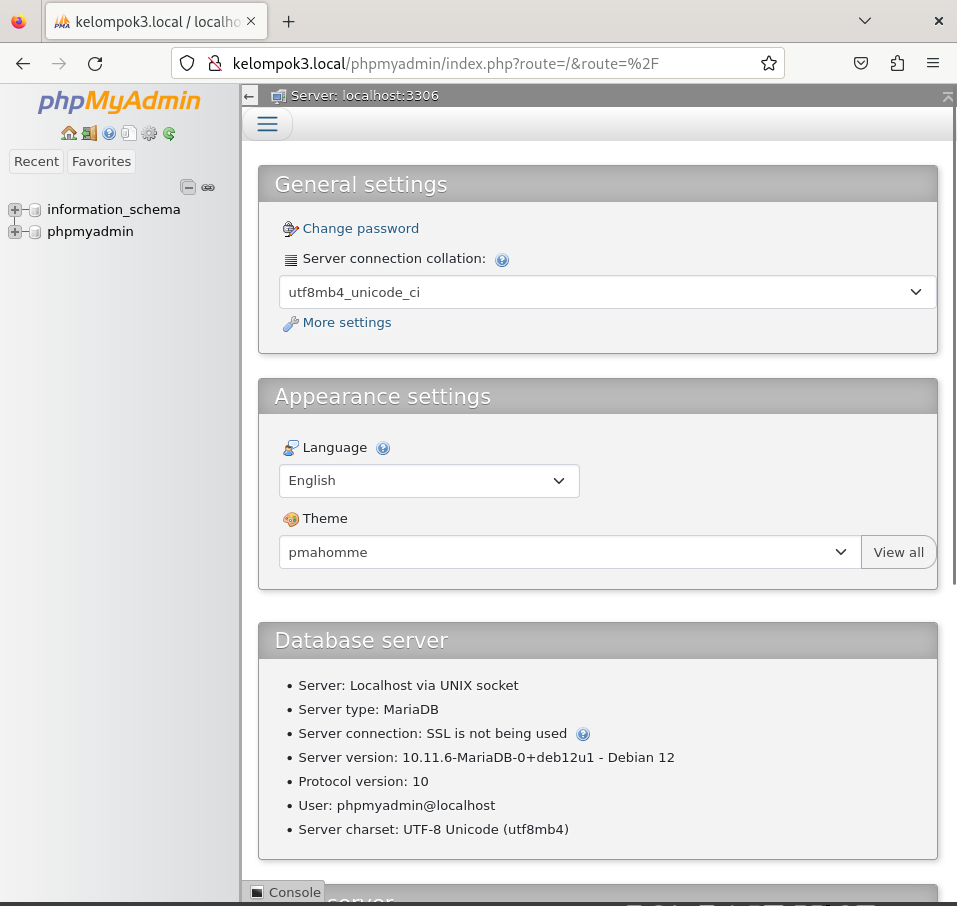
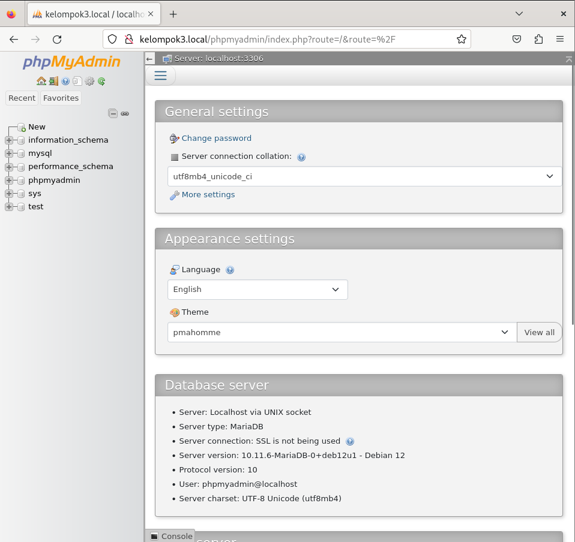

# Install phpmyadmin

## 1. Install phpmyadmin
```sudo apt -y install phpmyadmin```
Konfigurasi installasi
- Pilih web server yang digunakan, pada contoh ini menggunakan apache2
  
  

- Pilih configure database for phpmyadmin dengan dbconfig-common
  
  

- Masukkan password root phpmyadmin dan konfirmasi password root phpmyadmin
  
  


## 2. Konfigurasi phpmyadmin pada apache2
```sudo nano /etc/apache2/apache2.conf```
Tambahkan baris berikut pada file konfigurasi apache2 di bagian paling bawah
```
Include /etc/phpmyadmin/apache.conf
```


## 3. Restart apache2
```sudo systemctl restart apache2```

## 4. Akses phpmyadmin
Buka browser dan akses phpmyadmin dengan alamat http://kelompok3.local/phpmyadmin



Masukkan username dan password root mysql yang telah diatur sebelumnya
contoh:
- username: phpmyadmin
- password: 123



## 5. menambahkan privilege user phpmyadmin
- login ke mysql ```mysql -u root -p```
- tambahkan privilege user phpmyadmin
```
GRANT ALL PRIVILEGES ON *.* TO 'phpmyadmin'@'localhost' IDENTIFIED BY 'password' WITH GRANT OPTION;
FLUSH PRIVILEGES;
```
Hasilnya kita dapat mengatur database melalui phpmyadmin
