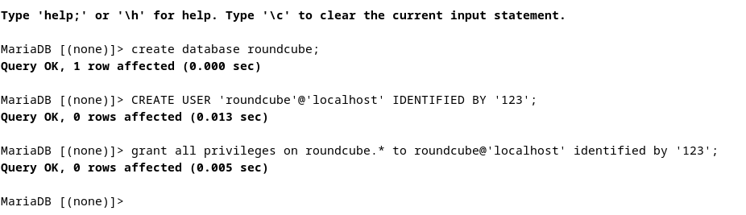
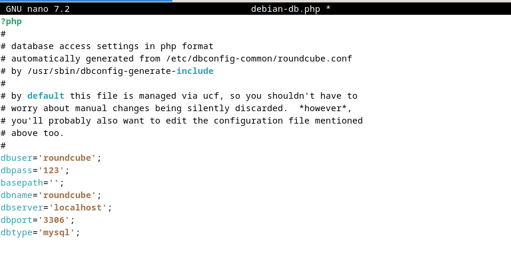

# Install Roundcube  

## 1. Buat Database yang akan digunakan oleh Roundcube
- Masuk ke MySQL
```mysql -u root -p```
- Buat Database
```CREATE DATABASE roundcubemail;```
- Buat User
```CREATE USER 'roundcube'@'localhost' IDENTIFIED BY 'password';```
- Berikan Hak Akses
```grant all privileges on roundcube.* to roundcube@'localhost' identified by 'password'; ```



## 2. Install Roundcube
```sudo apt-get install -y roundcube roundcube-mysql```

```
┌──────────────────────────────────┤ Configuring roundcube-core ├───────────────────────────────────┐
 │                                                                                                   │ 
 │ The roundcube package must have a database installed and configured before it can be used. This   │ 
 │ can be optionally handled with dbconfig-common.                                                   │ 
 │                                                                                                   │ 
 │ If you are an advanced database administrator and know that you want to perform this              │ 
 │ configuration manually, or if your database has already been installed and configured, you        │ 
 │ should refuse this option. Details on what needs to be done should most likely be provided in     │ 
 │ /usr/share/doc/roundcube.                                                                         │ 
 │                                                                                                   │ 
 │ Otherwise, you should probably choose this option.                                                │ 
 │                                                                                                   │ 
 │ Configure database for roundcube with dbconfig-common?                                            │ 
 │                                                                                                   │ 
 │                            <Yes>                               <No>                               │ 
 │                                                                                                   │ 
 └───────────────────────────────────────────────────────────────────────────────────────────────────┘ 
```

Pilih `<No>` karena kita sudah membuat database sebelumnya

## 3. Konfigurasi Roundcube
- Masuk ke direktori konfigurasi
```cd /usr/share/dbconfig-common/data/roundcube/install/```
- import database
```mysql -u roundcube -D roundcube -p < mysql``` kemudian masukkan password yang telah dibuat sebelumnya
- Konfigurasi database
```sudo nano /etc/roundcube/debian-db.php```

sesuaikan credential database dengan yang telah dibuat sebelumnya
- Konfigurasi Roundcube
```sudo nano /etc/roundcube/config.inc.php```
    - ubah line 27 ``` $config['imap_host'] = ["tls://mail.kelompok3.local:143"];```
    - ubah line 31 ``` $config['smtp_host'] = 'tls://mail.kelompok3.local:587'; ```
    - ubah line 39 ``` $config['smtp_pass'] = '%p'; ``` 
    - ubah line 46 ``` $config['product_name'] = 'Server Mail PENS'; ```
    - tambah pada baris paling akhir
    ```
    $config['smtp_auth_type'] = 'LOGIN';
    // specify SMTP HELO host
    $config['smtp_helo_host'] = 'mail.kelompok3.local';

    // specify domain name
    $config['mail_domain'] = 'mail.kelompok3.local';

    // specify UserAgent
    $config['useragent'] = 'Server World Webmail';
    // specify SMTP and IMAP connection option
    $config['imap_conn_options'] = array(
        'ssl'         => array(
            'verify_peer' => true,
            'CN_match' => 'kelompok3.local',
            'allow_self_signed' => true,
            'ciphers' => 'HIGH:!SSLv2:!SSLv3',
        ),
    );
    $config['smtp_conn_options'] = array(
    'ssl'   => array(
            'verify_peer' => true,
            'CN_match' => 'kelompok3.local',
            'allow_self_signed' => true,
            'ciphers' => 'HIGH:!SSLv2:!SSLv3',
        ),
    );
    ```
    - konfigurasi webserver untuk roundcube ```sudo nano  /etc/apache2/conf-enabled/roundcube.conf```
    uncomment baris ke 3
    ```Alias /roundcube /var/lib/roundcube/public_html```
