# Konfigurasi Web Server (apache2) dan PHP fpm

## 1. Install apache2 dan php-fpm
```sudo apt-get install apache2 -y```

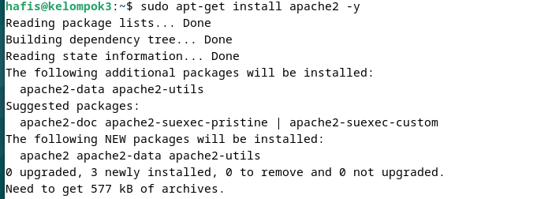

## 2. Konfigurasi apache2
Lakukan konfigurasi security apache2
- ```sudo nano /etc/apache2/conf-enabled/security.conf```
  
   Ubah bagian ```ServerTokens``` menjadi ```Prod```

    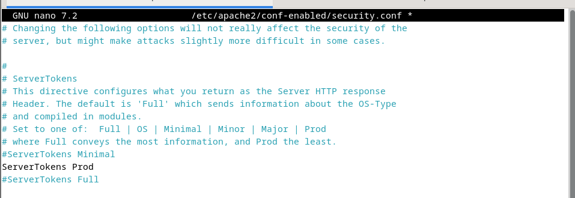
Lakukan konfigurasi directory apache2 
- ```sudo nano /etc/apache2/mods-enabled/dir.conf```
  
    Ubah bagian ```DirectoryIndex``` menjadi ```index.html index.htm```

  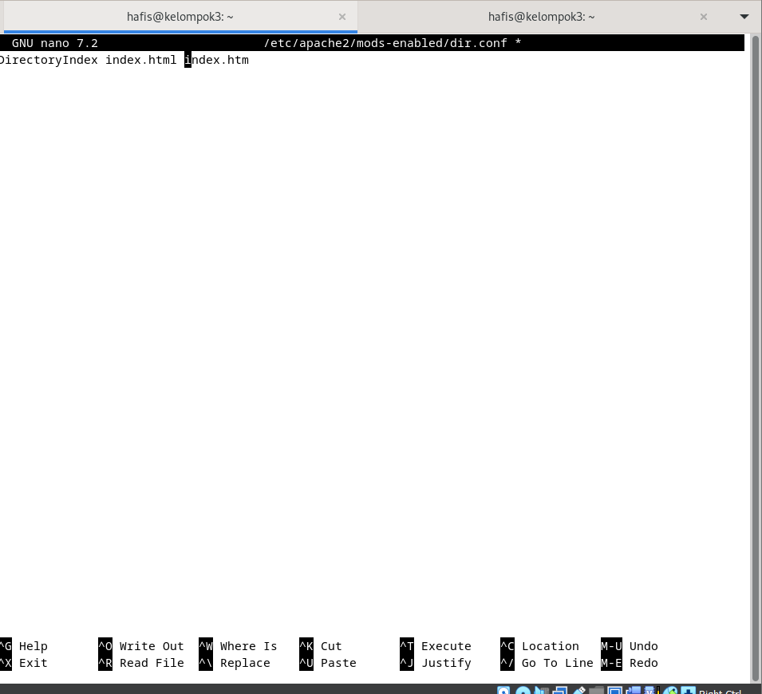

Tambahkan virtual host yang sudah disiapkan berdasarkan Canonical Name (CNAME) yang sudah dibuat (kelompok3.local)

- ```sudo nano /etc/apache2/apache2.conf```

Tambahkan ServerName www.kelompok3.local

  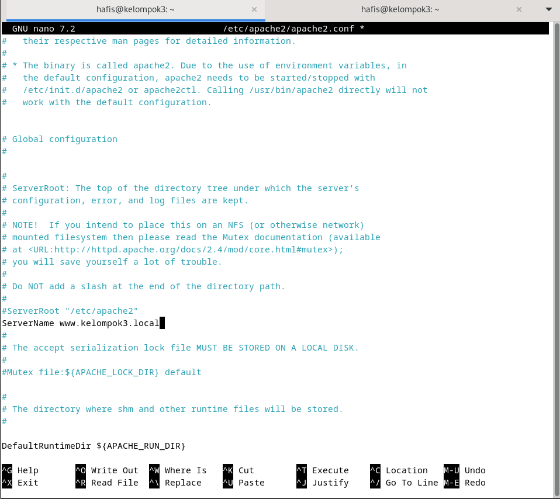

Ubah Kontak email admin menjadi email webmaster@kelompok3.local
- ```sudo nano /etc/apache2/sites-available/000-default.conf```
  
  Ubah bagian ```webmaster@localhost``` menjadi ```webmaster@kelompok3.local```

  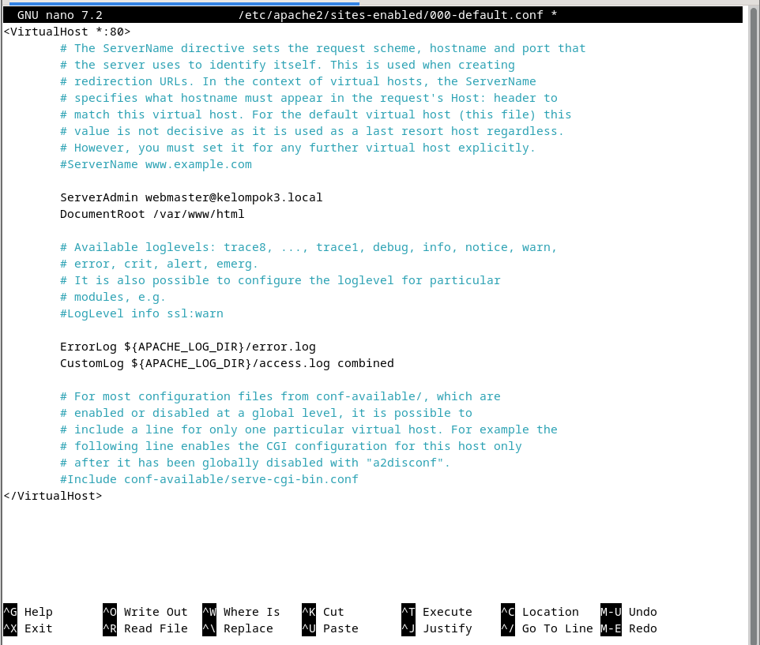


## 3. Restart apache2 dan cek status apache2
```sudo systemctl restart apache2```
```sudo systemctl status apache2```

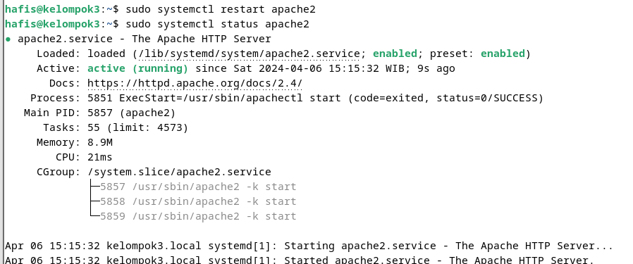


## 4. Lakukan Pengujian di browser
Buka browser dan ketikkan alamat www.kelompok3.local

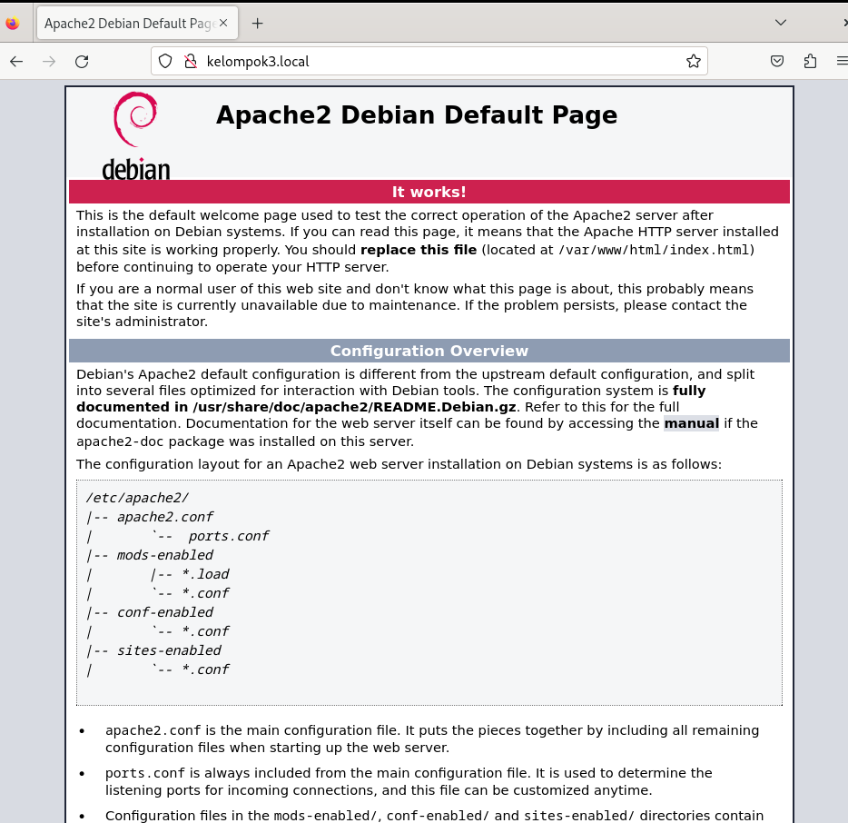

## 5. Install PHP dan extensi mbstring serta lakukan pengujian
fungsi mbstring digunakan untuk memanipulasi string atau text non  ASCII
```sudo apt -y install php8.2 php8.2-mbstring php-pear```
```php -v```

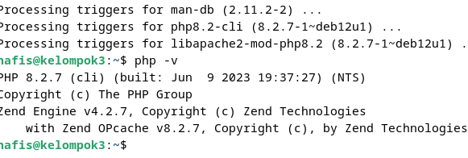

buat file php_info.php di /var/www/html
```sudo nano /var/www/html/php_info.php```

isi file php_info.php dengan kode berikut
```<?php phpinfo(); ?>```

Buka browser dan ketikkan alamat www.kelompok3.local/php_info.php

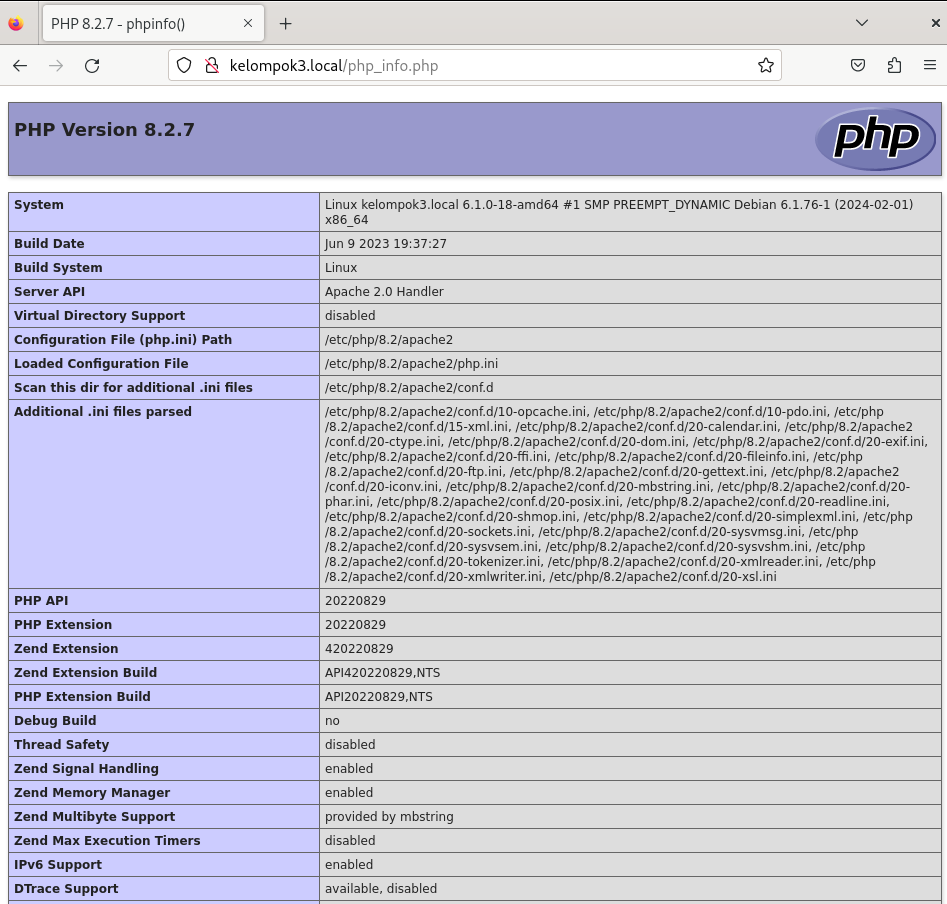

## 6. Install dan konfigurasi PHP-FPM
php fpm adalah FastCGI Process Manager untuk PHP berfungsi sebagai server untuk PHP
```sudo apt -y install php-fpm```

## 7. Konfigurasi PHP-FPM di apache2
- ```nano /etc/apache2/sites-available/default-ssl.conf```
    ini berfungsi untuk mengarahkan apache2 ke php-fpm
    tambahkan di dalam tag ```<VirtualHost *:443></VirtualHost>```
    
    ```
    <FilesMatch \.php$>
        SetHandler "proxy:unix:/var/run/php/php8.2-fpm.sock|fcgi://localhost/"
    </FilesMatch>
    ```
    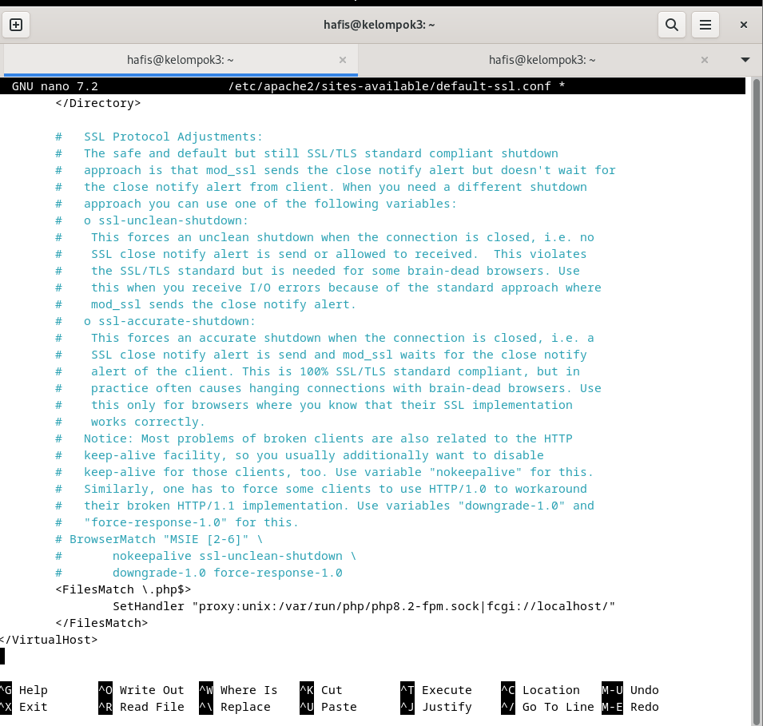
- ```a2enmod proxy_fcgi setenvif```
  Ini berfungsi untuk mengaktifkan modul proxy_fcgi dan setenvif
- ```a2enconf php8.2-fpm```
  Ini berfungsi untuk mengaktifkan konfigurasi php8.2-fpm
- ```systemctl restart php8.2-fpm apache2```
  Ini berfungsi untuk merestart php8.2-fpm dan apache2
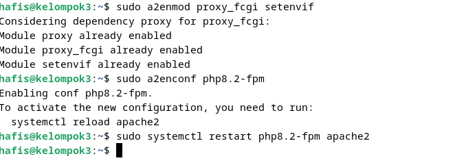


