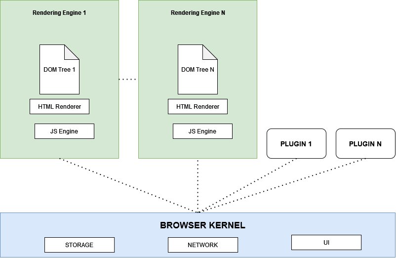
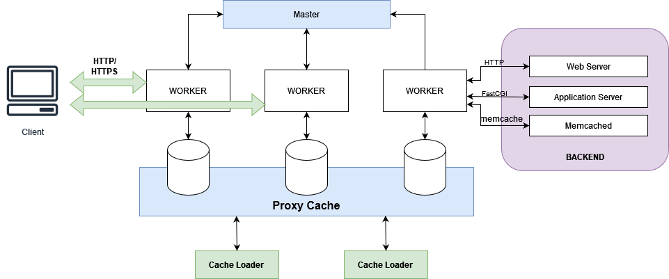

## Arsitektur Web Browser (Chrome)

### 1. Rendering Engine

   - **DOM Tree (Document Object Model):** Merupakan representasi struktur hierarkis dari elemen-elemen HTML dalam halaman web.
   - **HTML Renderer:** Bertanggung jawab untuk merender konten web sesuai dengan tata letak yang ditentukan oleh HTML dan stylesheet CSS.
   - **JavaScript Engine:** Mengolah dan mengeksekusi kode JavaScript untuk memberikan interaktivitas dan dinamika ke halaman web.

### 2. Plugin

   - Plugin adalah program tambahan yang memperluas kemampuan browser dengan menambahkan fitur tambahan seperti pemutaran video, pengolahan gambar, atau dukungan untuk format file tertentu.

### 3. Browser Kernel

   - **Storage:** Bertanggung jawab atas manajemen penyimpanan data lokal seperti cache, cookie, dan data pengguna lainnya.
   - **Network:** Mengelola koneksi jaringan untuk membuat permintaan ke server dan memproses tanggapan dari server.
   - **UI (User Interface):** Mengatur antarmuka pengguna browser, termasuk elemen-elemen seperti bilah alamat, tombol navigasi, tab, dan menu.

## Arsitektur Web Server (NGINX)

### 1. Master

NGINX mengikuti arsitektur master-slave di mana Master berperan dalam mengalokasikan pekerjaan untuk Workers sesuai dengan permintaan dari klien. Setelah pekerjaan dialokasikan kepada Workers, Master tidak menunggu respons dari Workers dan segera mencari permintaan berikutnya dari klien. Begitu respons diterima dari Workers, Master akan mengirimkannya kembali kepada klien.

### 2. Workers

Workers adalah 'slave' dalam arsitektur NGINX yang tunduk pada Master. Setiap Worker dapat menangani lebih dari 1000 permintaan pada satu waktu dalam mode single-threaded. Setelah proses selesai, respons akan dikirimkan kembali ke Master. Penggunaan single-threaded menghemat penggunaan RAM dan ROM dengan bekerja pada ruang memori yang sama daripada ruang memori yang berbeda. 

### 3. Cache

NGINX cache digunakan untuk merender halaman dengan cepat dengan mengambil dari memori cache daripada mengambil dari server. Halaman disimpan dalam memori cache saat permintaan pertama untuk halaman tersebut.

## Fitur

Berikut adalah beberapa fitur utama NGINX:

- Instalasi dan pemeliharaan yang mudah
- Meningkatkan kinerja server
- Mengurangi waktu tunggu bagi pengguna
- Penyeimbangan beban
- Pembaruan secara langsung
- Menyediakan kemampuan server HTTP
- Dirancang untuk kinerja dan stabilitas maksimum
- Fungsi-fungsi untuk server proxy

