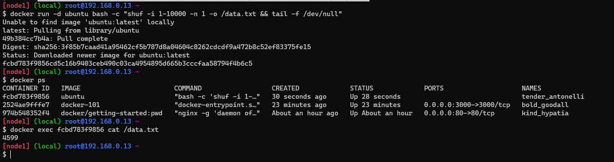
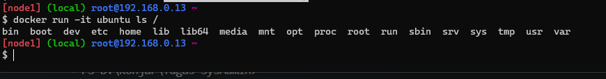
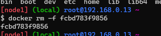
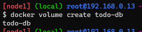
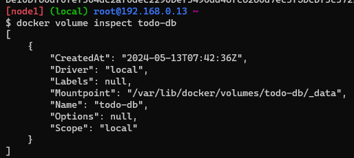

# Presisting Our Database

1. Jalankan container ubuntu serta membuat file bernama `data.txt`:
    ```bash
    docker run -d ubuntu bash -c "shuf -i 1-10000 -n 1 -o /data.txt && tail -f /dev/null"
    ```
    
2. Melihat container yang berjalan:
    ```bash
    docker ps
    ```
3. Buat container ubuntu yang lain dan kita akan melihat bahwa file `data.txt` tidak ada:
    ```bash
    docker run -it ubuntu ls
    ```
    

4. Kembali dan hapus container yang pertama:
    ```bash
    docker rm -f <container_id>
    ```
    

5. Buat volume dengan menggunakan ```docker volume create```:
    ```bash
    docker volume create todo-db
    ```
    

6. Hentikan todo-app yang berjalan:
    ```bash
    docker stop <container_id>
    ```
7. Jalankan todo-app dengan volume yang telah dibuat tapi dengan menambahkan atribut ```-v```:
    ```bash
    docker run -d -p 3000:3000 -v todo-db:/etc/todos getting-started
    ```
    
8. inspect volume yang telah dibuat:
    ```bash
    docker volume inspect todo-db
    ```
    
