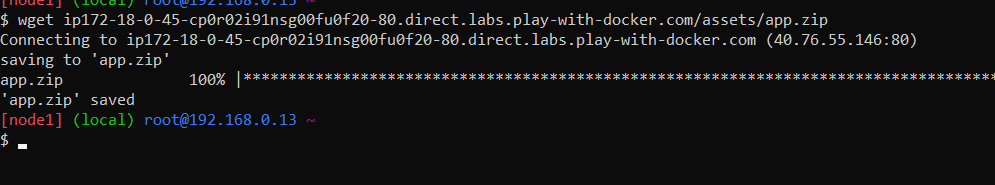
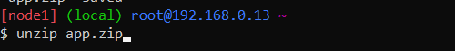
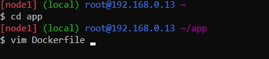
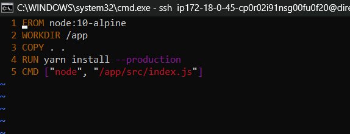
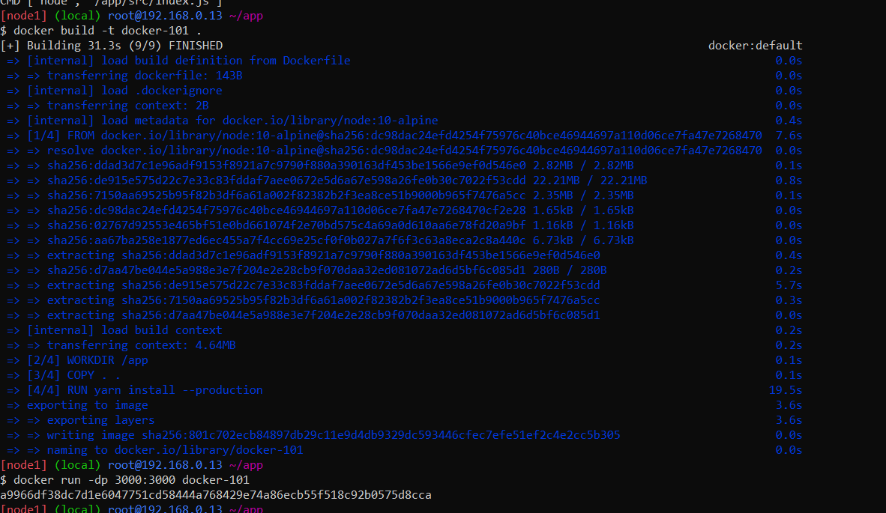
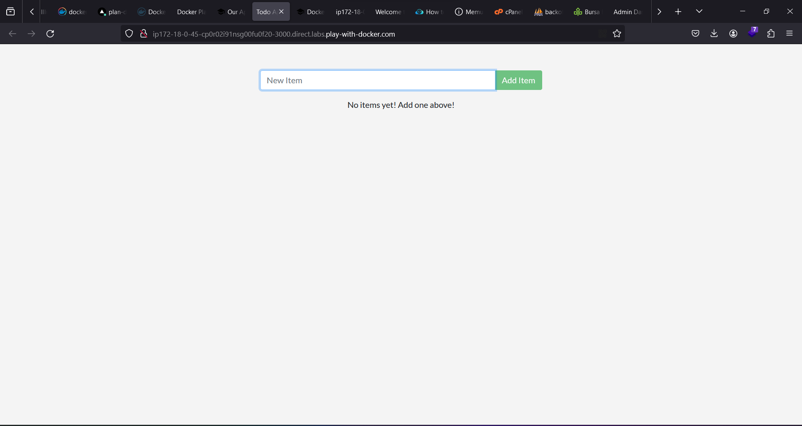

# Getting our App into PWD
1. Download Getting Started with PWD
2. Download file menggunakan wget:
```wget http://ip172-18-0-53-cp4cola91nsg00ebdma0-80.direct.labs.play-with-docker.com/assets/app.zip```

3. Unzip the file:
```unzip app.zip```

4. Edit Dockerfile: 
    ```vim Dockerfile```

    
5. Isi Dockerfile:
    ```
    FROM node:18-alpine
    WORKDIR /app
    COPY . .
    RUN yarn install --production
    CMD ["node", "src/index.js"]
    ```
    
6. Build Docker image:
```docker build -t getting-started .```

7. Run Docker image:
```docker run -d -p 3000:3000 getting-started```
8. Buka port 3000 dari instance PWD:
```http://ip172-18-0-53-cp4cola91nsg00ebdma0-3000.direct.labs.play-with-docker.com/```


