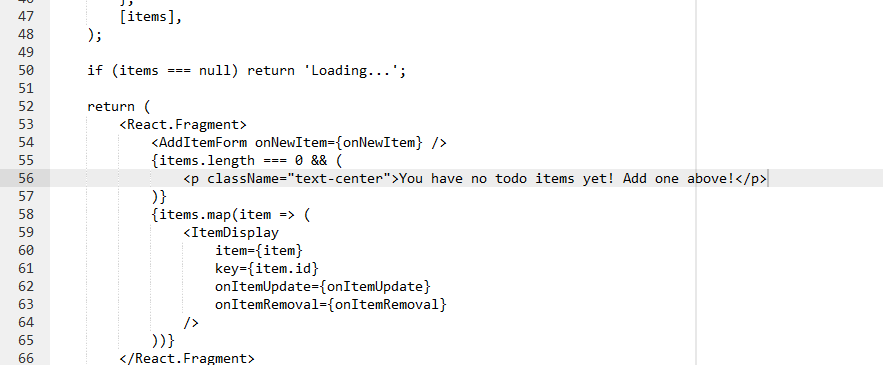
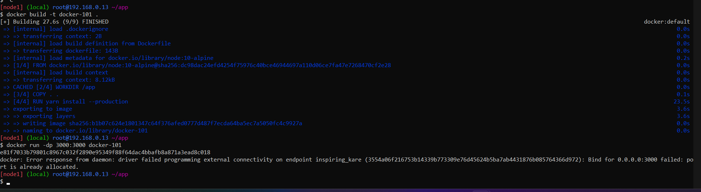
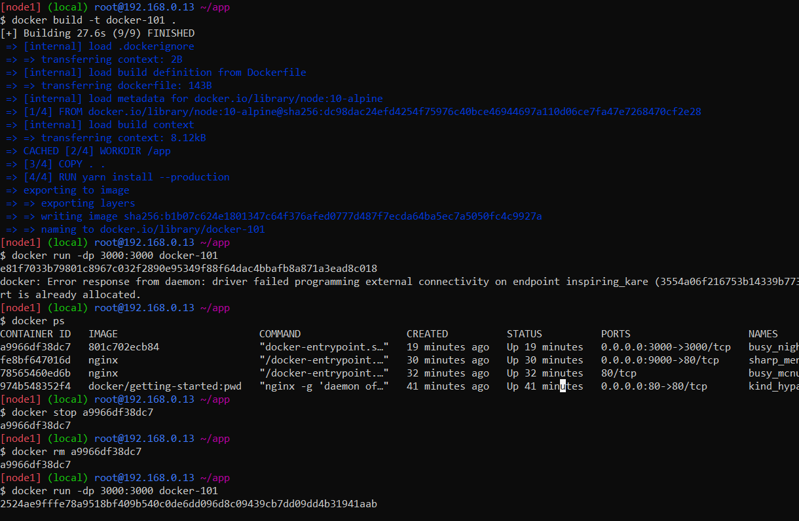
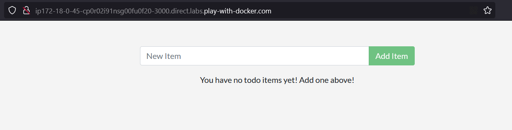

# Updating our source code
1. Edit file `src/static/js/app.js`:
    ```javascript
    -<p className="text-center">No items yet! Add one above!</p>
    +<p className="text-center">You have no todo items yet! Add one above!</p>
    ```
    
2. Build image yang telah diupdate:
    ```bash
    docker build -t getting-started .
    ```
3. Jalankan image yang telah diupdate:
    ```bash
    docker run -d -p 3000:3000 getting-started
    ```
    menemukan error:
    ```bash
    docker: Error response from daemon: driver failed programming external connectivity on endpoint laughing_burnell (bb242b2ca4d67eba76e79474fb36bb5125708ebdabd7f45c8eaf16caaabde9dd): Bind for 0.0.0.0:3000 failed: port is already allocated.
    ```
    
4. Mencari container yang berjalan:
    ```bash
    docker ps
    ```
    menemukan container yang berjalan:
    ```bash
    CONTAINER ID   IMAGE            COMMAND                  CREATED          STATUS          PORTS                    NAMES
    <container_id> getting-started "docker-entrypoint.s…"   1 minute ago     Up 1 minute
    ```
5. Menghentikan container yang berjalan:
    ```bash
    docker stop <container_id>
    ```
6. Jalankan image yang telah diupdate:
    ```bash
    docker run -d -p 3000:3000 getting-started
    ```
    
7. Buka port 3000 dari instance PWD:
    ```bash
    http://ip172-18-0-53-cp4cola91nsg00ebdma0-3000.direct.labs.play-with-docker.com/
    ```
    
    