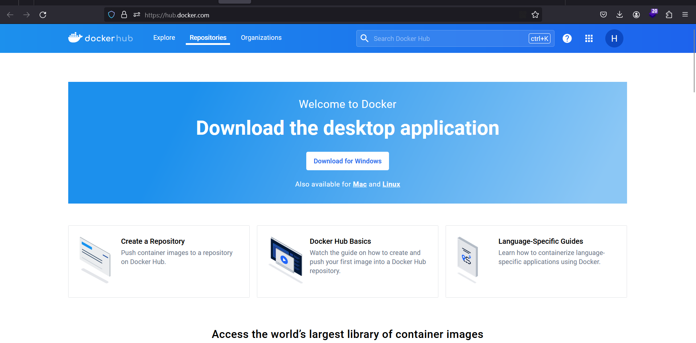
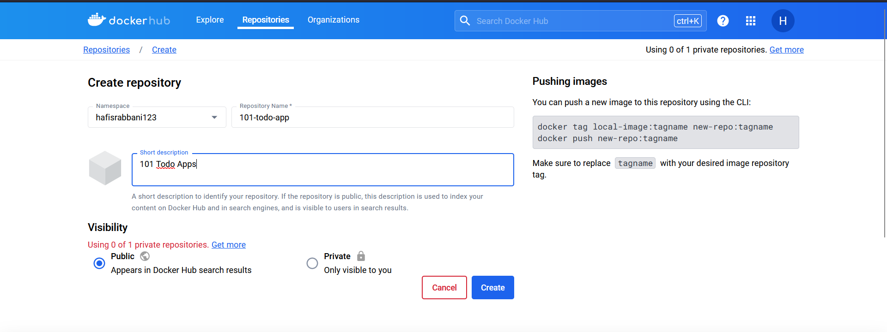
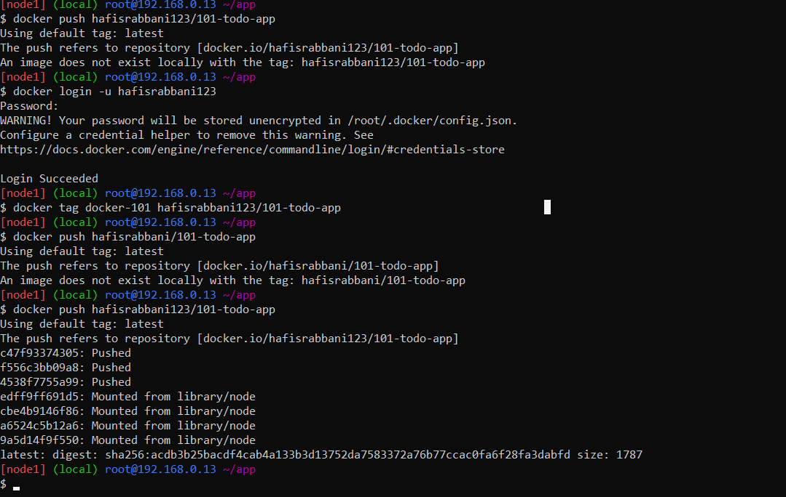
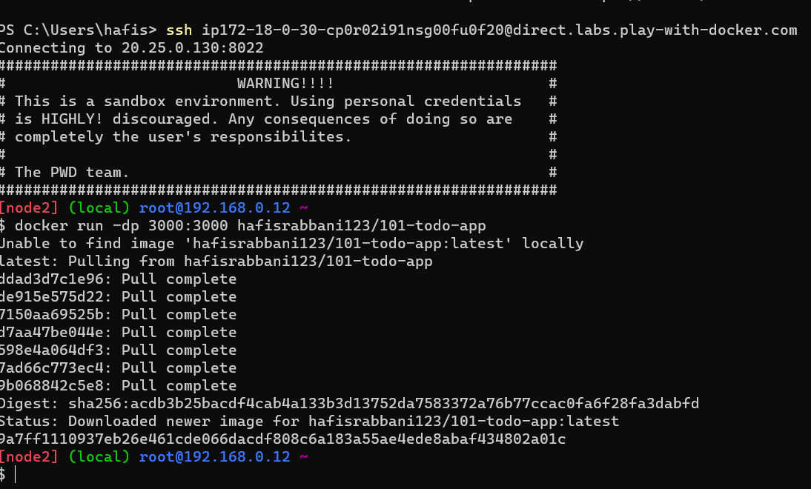

# Sharing Our Apps
1. Buka Docker Hub: [https://hub.docker.com/](https://hub.docker.com/) dan login.
   
2. Buat repository baru dengan nama `101-todo-app`. 
   
3. Setting visibility menjadi `Public` dan klik `Create`.
4. Push image ke Docker Hub:
   ```bash
   docker tag getting-started <username>/101-todo-app
   docker push <username>/101-todo-app
   ```
   
5. Buat instance baru di PWD dan jalankan image yang telah di-push:
   ```bash
   docker run -d -p 3000:3000 <username>/101-todo-app
   ```
   
6. Buka port 3000 dari instance PWD:
   ```bash
    http://ip172-18-0-53-cp4cola91nsg00ebdma0-3000.direct.labs.play-with-docker.com/
    ```
