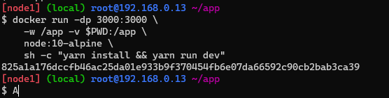
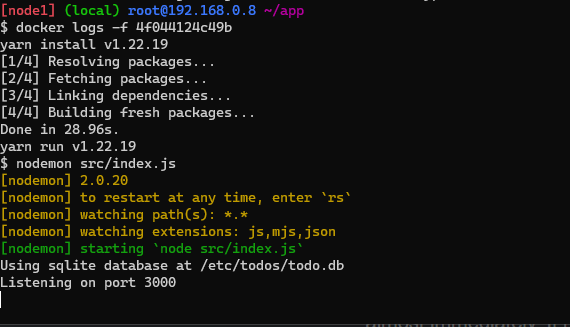
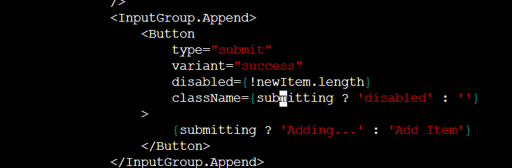
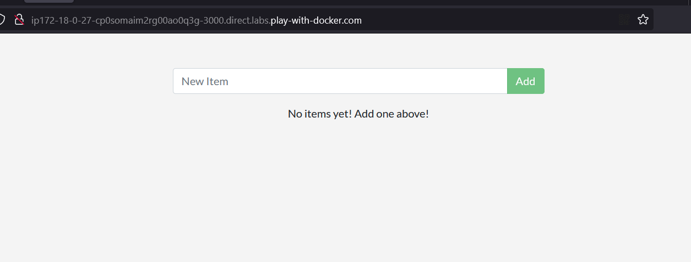

# Using Bind Mounts
1. Pastikan bahwa kita tidak punya container 101-todo-app yang berjalan:
    ```bash
    docker ps
    ```
2. Pastikan juga kita berada di directory aplikasi todo-app:
    ```bash
    cd ~/app
    ```
3. Jalankan container 101-todo-app:
    ```bash
    docker run -dp 3000:3000 \
    -w /app -v $(pwd):/app \
    node:12-alpine \
    sh -c "yarn install && yarn run dev"
    ```
    ini akan menjalankan container 101-todo-app dan mengikat port 3000 dari container ke port 3000 dari host.
    
4. Kita dapat melihat log dari container 101-todo-app:
    ```bash
    docker logs <container_id>
    ```
    
5. Mengubah file `src/static/js/app.js`:
    ```bash
    vim src/static/js/app.js
    ```
    

6. Refresh browser, maka kita akan melihat perubahan yang kita buat.
    