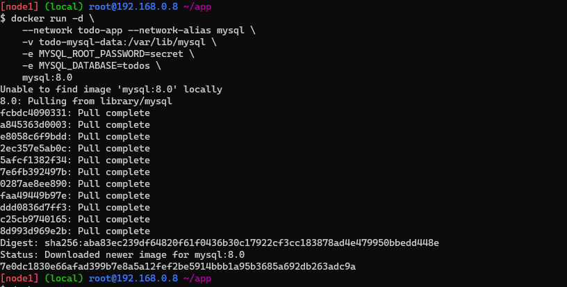
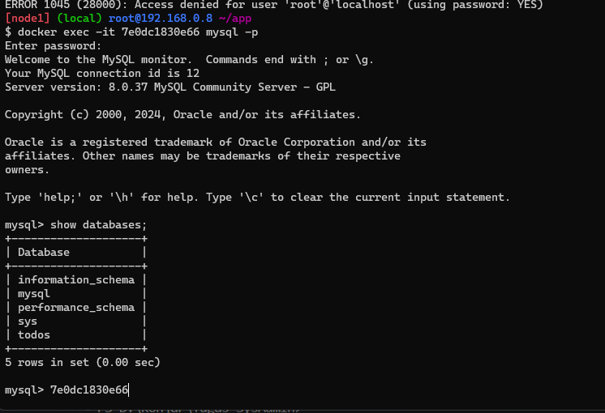
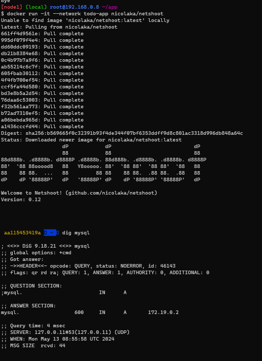
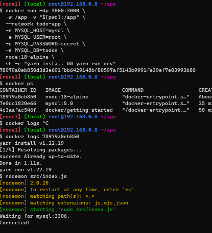

# Multi Container Apps
1. Membuat network:
    ```bash
    docker network create todo-app
    ```
2. Jalankan mysql container dan tambahkan ke network todo-app:
    ```bash
    docker run -d \
    --network todo-app --network-alias mysql \
    -v todo-mysql-data:/var/lib/mysql \
    -e MYSQL_ROOT_PASSWORD=secret \
    -e MYSQL_DATABASE=todos \
    mysql:8.0
    ```
    
3. Untuk memastikan bahwa kita sudah membuat database kita dapat menggunakan command berikut:
    ```bash
    docker exec -it <container_id> mysql -p
    ```
    

4. Jalankan container baru dengan nicolaka/netshoot image:
    ```bash
    docker run -it --network todo-app nicolaka/netshoot
    ```
5. Didalam container netshoot, kita dapat menggunakan command berikut untuk mengecek apakah mysql sudah berjalan:
    ```bash
    dig mysql
    ```
    
6. Selanjutnya kita mengkonfigurasi aplikasi todo-app dan menghubungkannya dengan mysql
7. Jalankan container todo-app:
    ```bash
    docker run -dp 3000:3000 \
    -w /app -v $(pwd):/app \
    --network todo-app \
    -e MYSQL_HOST=mysql \
    -e MYSQL_USER=root \
    -e MYSQL_PASSWORD=secret \
    -e MYSQL_DB=todos \
    node:12-alpine \
    sh -c "yarn install && yarn run dev"
    ```
    
    