# Tugas 1 - SysAdmin
### Dosen Pengampu : Dr. Ferry Astika Saputra, S.T., M.Sc.
### Kelompok : 3
### Anggota :
1. 31225000001 - Ade Hafis Rabbani
2. 31225000002 - Nadila Aulya Salsabila Mirdianti
3. 31225000016 - Gandi Rukmaning Ayu

## Daftar Isi
1. [Soal 1](#1-buatlah-tulisan-tentang-langkah-langkah-instalasi-sistem-operasi-debian-anda-bisa-menggunakan-aplikasi-virtualisasi-seperti-virtualbox-vmware-player-vmware-fusion-mac-dls-kebutuhan-sistem-adalah-sebagai-berikut-)
2. [Soal 2](#2-buat-ringkasan-tentang-perbedaan-dari-debian-12-bookworm-dengan-debian-11-bullseye-versi-kernel-kebutuhan-sistem-penerapan-systemd-dan-perbedaan-packagenya-dalam-bentuk-tabel-)
3. [Soal 3](#3-jelaskan-fungsi-dari-file-etcgroups-beserta-formatnya)
4. [Soal 4](#4-jelaskan-perbedaan-penggunaan-perintah-su-dengan-su-)
5. [Soal 5](#5-jelaskan-fungsi-dari-sudo-)
6. [Soal 6](#6-jelaskan-langkah-langkah-penambahan-user-anda-sebagai-user-sudo-gunakan-perintah-su-lalu-setelah-masuk-sebagai-root-jalankan-perintah-visudo-tambahkan-user-anda-di-bawah-user-root-pada-bagian--user-privilege-specification-)
7. [Referensi](#referensi)
# Laporan Tugas 1 - SysAdmin

### 1. Buatlah tulisan tentang langkah-langkah instalasi sistem operasi Debian. Anda bisa menggunakan aplikasi virtualisasi seperti VirtualBox, VMWare Player, Vmware Fusion (MAC), dls. Kebutuhan sistem adalah sebagai berikut :
- CPU : 2 core
- RAM : 4096 (min)
- HDD : 25GB dengan partisi :
    - / : 20 GB
    - /storage : 5 GB
    - swap : 1,5 GB
- Hostname : SysAdmin-NRP

**Jawab:**

1. Buka aplikasi **Oracle VM VirtualBox Manager**, kemudian pilih **New**.

2. Sesuaikan **Name** dan **Folder**. Pada bagian Iso Image, pilih file **ISO Debian** yang sudah di download. Click pada bagian **Skip Unattended Installation** dan **Next**.

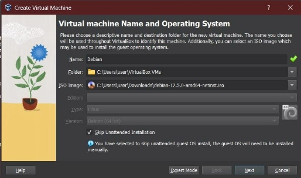

3. Pada bagian Hardware, setting **Base Memory** minimal sebesar **4096 MB** dan **Processor** minimal sebesar **2 Core**. Kemudian pilih **Next**.

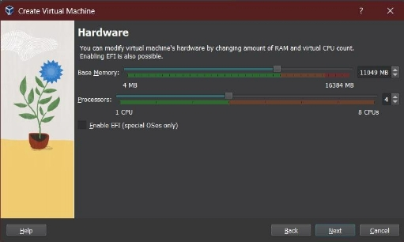

4. Bagian **Virtual Hard Disk** setting **Disk Size** sebesar **26,5 GB** yang nantinya akan dibagi menjadi 3 partisi, kemudian!

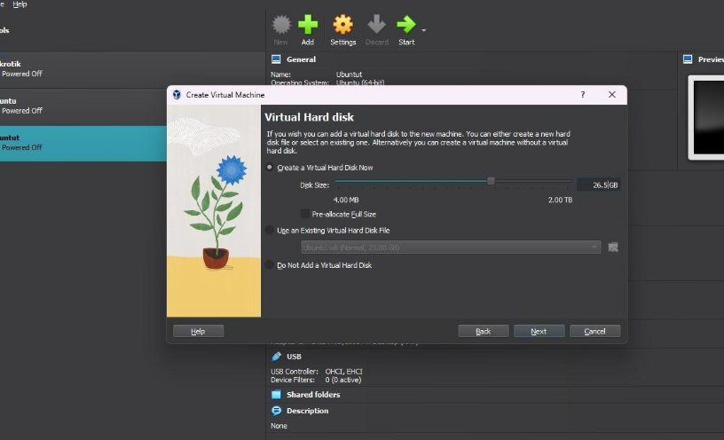 **Next**.

5. Setelah selesai, pada bagian **Summary** click tombol **Finish**.

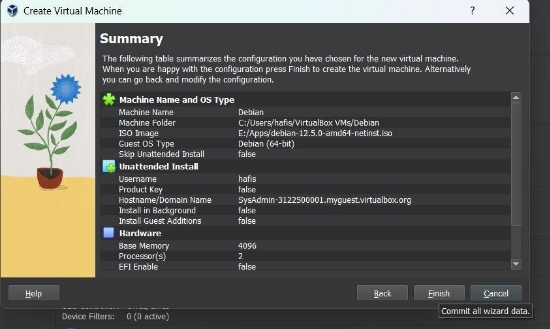

6. Pilih **Debian** dan click **Start** untuk memulai.

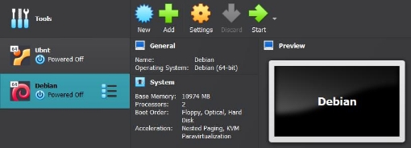

7. Setelah selesai booting akan tampil seperti gambar dibawah ini, kemudian pilih **Graphical Install**.

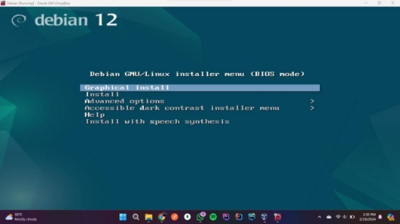

8. Pilih **bahasa** yang nantinya ingin anda gunakan, kemudian click **Continue**.

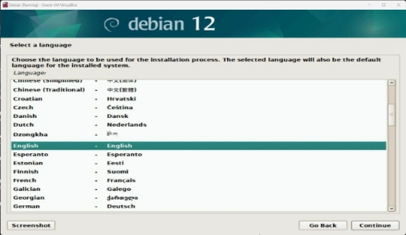

9. Pilih **Lokasi** anda, kemudian click **Continue**.

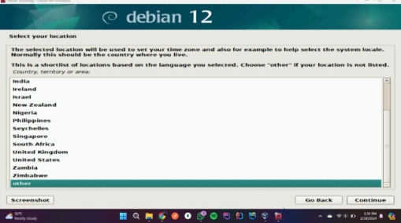

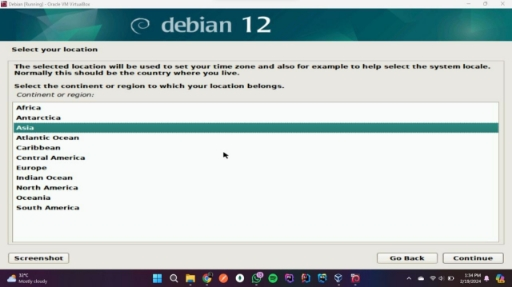

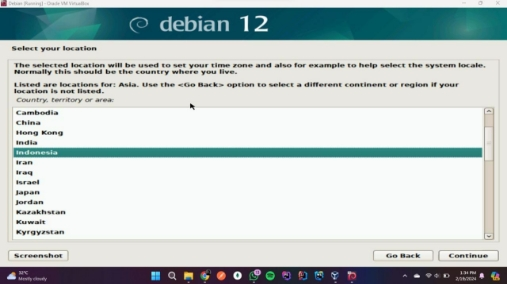

10. **Konfigurasi keyboard** yang ingin anda gunakan, click **Continue** dan tunggu hingga selesai.

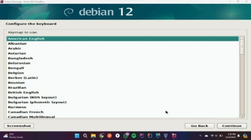

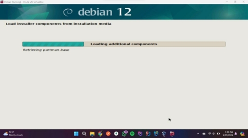

11. Pada bagian **Konfigurasi Network** masukkan **Hostname** anda dan kosongkan untuk bagian **Domain Name**, kemudian click **Continue**.

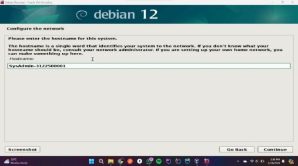

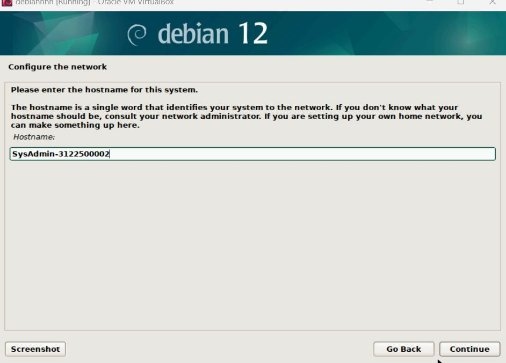

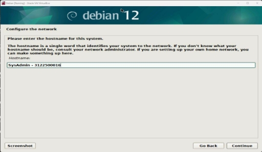

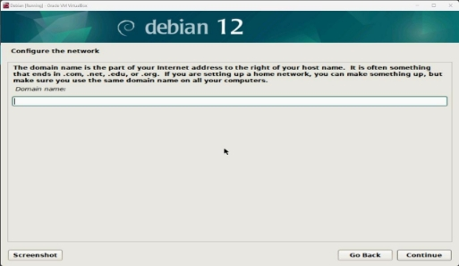

12. Pada Bagian **Set Up users and password** sesuaikan **Password, Fullname dan Username** anda, kemudian click **Continue**.

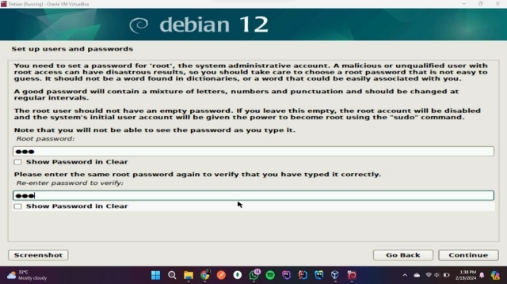

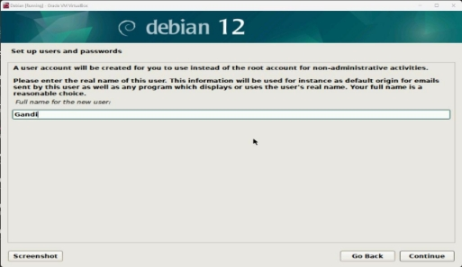

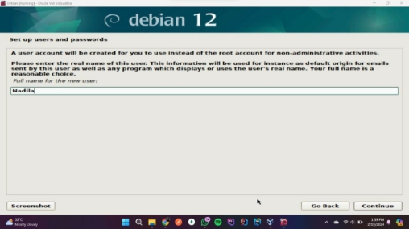

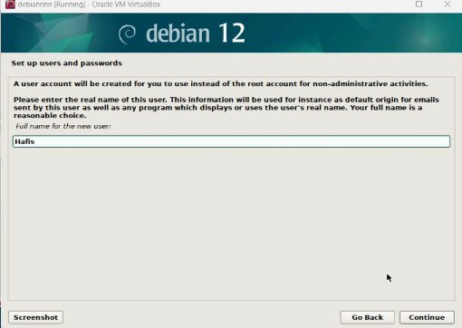

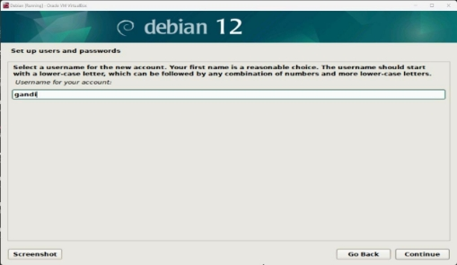

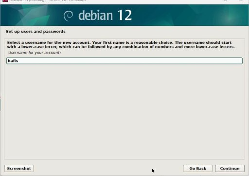

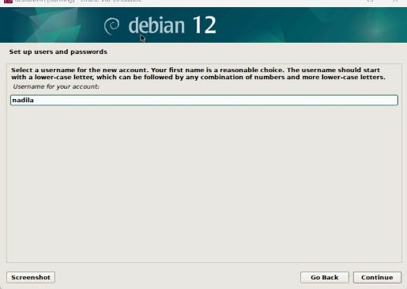

13. Pada bagain **Configure the clock** sesuaikan waktu yang ada di lokasi anda, kemudian click **Continue** dan tunggu hingga selesai.

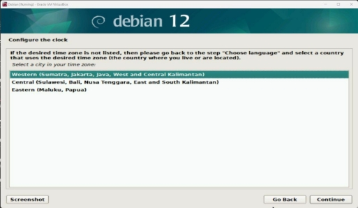

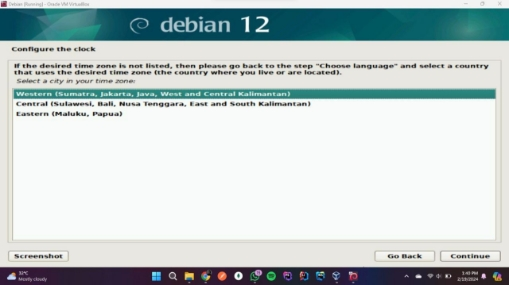

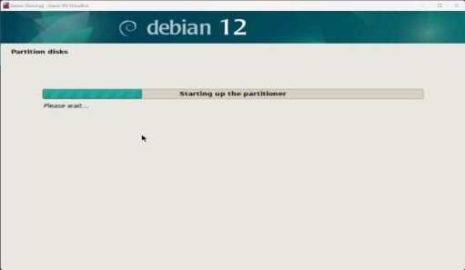

14. Pilih **manual** untuk setting partisi, kemudian pilih **SCSI3 (0,0,0) (sda) - 21.5 GB ATA VBOX HARDDISK**. Pada bagian **Create new empty partition table on this device** pilih **Yes**. Setelah itu, pilih free space yang tersedia, kemudian **Create a new partition**. Untuk **Partition Size** masukkan sebesar **20 GB** tipenya **Primary**. Pastikan **Bootable flag** dalam keaadan **On**, kemudian pilih **Done setting up the partition**. Setelah selesai, ulangi step sebelumnya untuk setting partisi **/storage** sebesar **5 GB** dan **swap** sebesar **1,5 GB**.

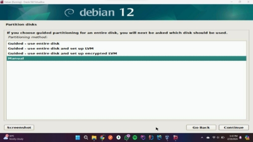

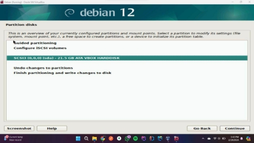

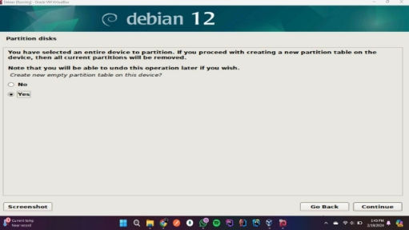

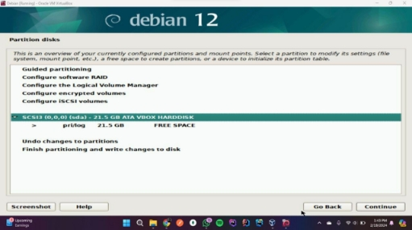

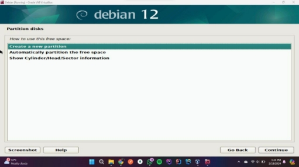

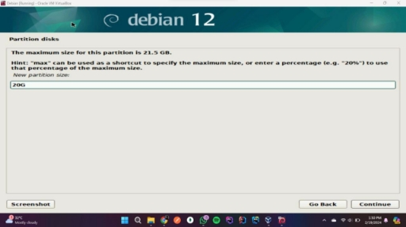

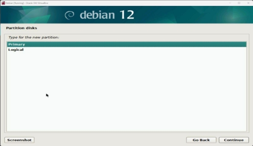

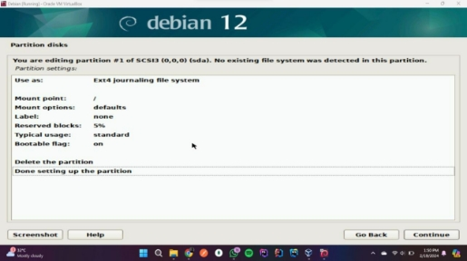

15. Setelah selesai, pilih **Finish partitioning and write changes to disk** dan tunggu hingga selesai.

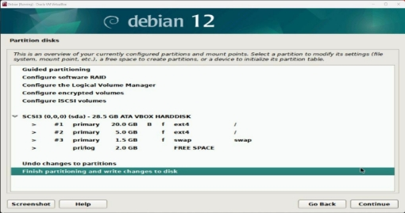

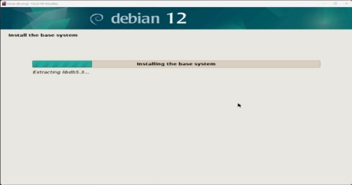

16. Untuk **Configure the package manager** pada bagian **Scan extra installation media** pilih **No**. Untuk **Debian archive mirror country** pilih Indonesia dan **Debian archive mirror** pilih **deb.debian.org.** Selanjutnya biarkan kosong untuk bagian **HTTP proxy information** dan tunggu hingga selesai.

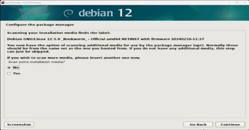

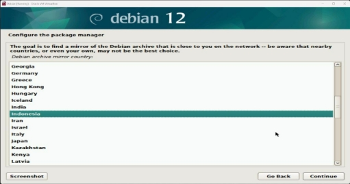

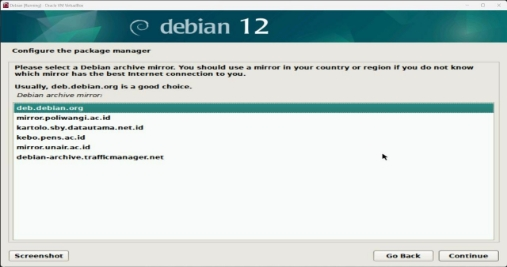

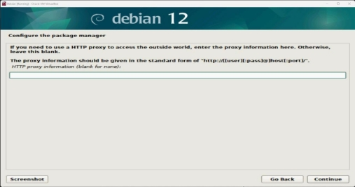

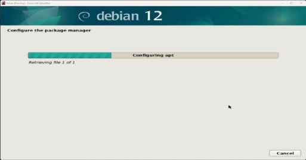

17. Pada bagian **Configuring popularity-contest** pilih **No**.

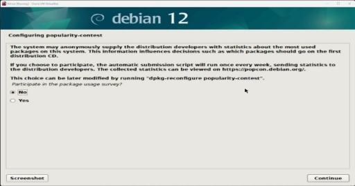

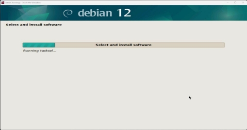

18. Untuk **Software selection** pilih **Debian desktop environment, GNOM** dan **Standart system utilities**, kemudian tunggu hingga selesai.

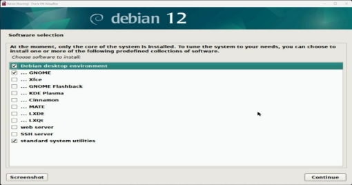

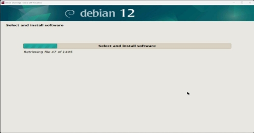

19. Pada bagian **Install the GRUB boot loader** untuk **Install the GRUB boot loader** pilih **Yes** dan **Device for boot loader** pilih **/dev/sda (ata-VBOX\_HARDDISK\_VBcf87d4ff-45acc2fe).** Click **Continue** dan tunggu hingga selesai.

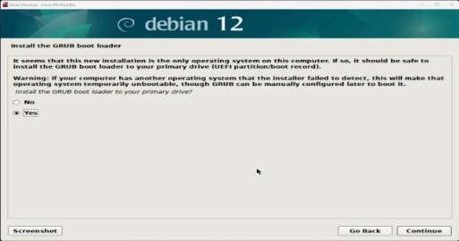

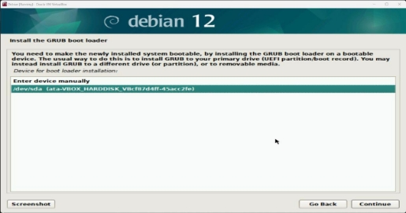

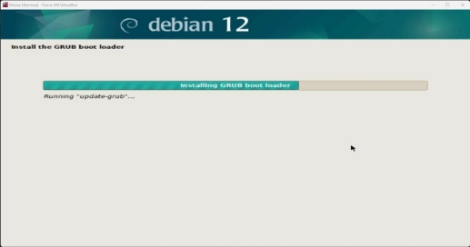

20. Setelah selesai, click **Continue** dan sistem akan **Rebooting**.

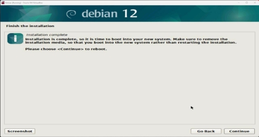

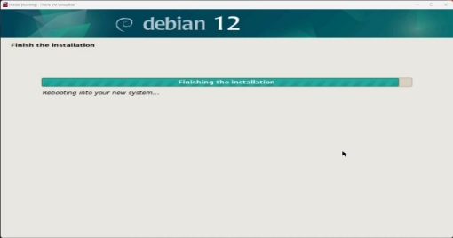

21. Setelah selesai, tampilan layar akan seperti dibawah ini.

### 2. Buat ringkasan tentang perbedaan dari Debian 12 (bookworm) dengan Debian 11 (bullseye) : versi kernel, kebutuhan sistem, penerapan systemd dan perbedaan packagenya (dalam bentuk tabel) !

   **Jawab:**

<table><tr><th colspan="2"></th><th colspan="1"><b>Debian 11 (Bullseye)</b></th><th colspan="1"><b>Debian 12 (Bookworm)</b></th></tr>
<tr><td colspan="2"><b>Versi Kernel</b></td><td colspan="1">5\.10 Series</td><td colspan="1">6\.1 Series</td></tr>
<tr><td colspan="1" rowspan="5"><b>Kebutuhan Sistem</b></td><td colspan="1"><b>Arsitektur</b></td><td colspan="1">
- 32-bit PC (<b>i386</b>) and 64-bit PC (<b>amd64</b>)

- 64-bit ARM (<b>arm64</b>)

- ARM EABI (<b>armel</b>)

- ARMv7 (EABI hard-float ABI, <b>armhf</b>)

- little-endian MIPS (<b>mipsel</b>)

- 64-bit little-endian MIPS (<b>mips64el</b>)

- 64-bit little-endian PowerPC (<b>ppc64el</b>)

- IBM System z (<b>s390x</b>)
</td><td colspan="1">
- 32-bit PC (<b>i386</b>) and 64-bit PC (<b>amd64</b>)

- 64-bit ARM (<b>arm64</b>)

- ARM EABI (<b>armel</b>)

- ARMv7 (EABI hard-float ABI, <b>armhf</b>)

- little-endian MIPS (<b>mipsel</b>)

- 64-bit little-endian MIPS (<b>mips64el</b>)

- 64-bit little-endian PowerPC (<b>ppc64el</b>)

- IBM System z (<b>s390x</b>)
</td></tr>
<tr><td colspan="1"><b>RAM Minimum</b></td><td colspan="1">512 MB</td><td colspan="1">512 MB</td></tr>
<tr><td colspan="1"><b>Rekomendasi RAM</b></td><td colspan="1">2 GB</td><td colspan="1">2 GB</td></tr>
<tr><td colspan="1" valign="top"><b>Ruang Disk Minimum</b></td><td colspan="1" valign="top">10 GB</td><td colspan="1" valign="top">10 GB</td></tr>
<tr><td colspan="1"><b>Processor</b></td><td colspan="1">1 GHz</td><td colspan="1">1 GHz</td></tr>
<tr><td colspan="1" rowspan="3"><b>Penerapan Systemd</b></td><td colspan="1"><b>Versi Systemd</b></td><td colspan="1">247\.3-7+deb11u4</td><td colspan="1">252\.22-1~deb12u1</td></tr>
<tr><td colspan="1"><b>Dukungan Wayland</b></td><td colspan="1">Penuh</td><td colspan="1">Standar</td></tr>
<tr><td colspan="1" valign="top"><b>Performa dan Keamanan</b></td><td colspan="1" valign="top">Menggunakan versi Systemd 247.3 yang merupakan versi LTS dan akan mendapatkan dukungan hingga tahun 2026.</td><td colspan="1" valign="top">Menggunakan versi Systemd 252.22 yang merupakan versi terbaru dengan banyak fitur baru dan perbaikan bug.</td></tr>
<tr><td colspan="1" rowspan="5" valign="top"><b>Perbedaan Package</b></td><td colspan="1"><b>Apache</b></td><td colspan="1">2\.4.54</td><td colspan="1">2\.4.57</td></tr>
<tr><td colspan="1"><b>Bash</b></td><td colspan="1">5\.1</td><td colspan="1">5\.2.15</td></tr>
<tr><td colspan="1" valign="top"><b>BIND DNS Server</b></td><td colspan="1" valign="top">9\.16</td><td colspan="1" valign="top">9\.18</td></tr>
<tr><td colspan="1" valign="top"><b>Cryptsetup</b></td><td colspan="1" valign="top">2\.3</td><td colspan="1" valign="top">2\.6</td></tr>
<tr><td colspan="1" valign="top"><b>Emacs</b></td><td colspan="1" valign="top">27\.1</td><td colspan="1" valign="top">28\.2</td></tr>
</table>

<table><tr><th colspan="1" rowspan="23"></th><th colspan="1"><b>Exim default e-mail server</b></th><th colspan="1">4\.94</th><th colspan="1">4\.96</th></tr>
<tr><td colspan="1"><b>GNU Compiler Collection as default compiler</b></td><td colspan="1">10\.2</td><td colspan="1">12\.2</td></tr>
<tr><td colspan="1" valign="top"><b>GIMP</b></td><td colspan="1" valign="top">2\.10.22</td><td colspan="1" valign="top">2\.10.34</td></tr>
<tr><td colspan="1" valign="top"><b>GnuPG</b></td><td colspan="1" valign="top">2\.2.27</td><td colspan="1" valign="top">2\.2.40</td></tr>
<tr><td colspan="1" valign="top"><b>Inkspace</b></td><td colspan="1" valign="top">1\.0.2</td><td colspan="1" valign="top">1\.2.2</td></tr>
<tr><td colspan="1" valign="top"><b>the GNU C library</b></td><td colspan="1" valign="top">2\.31</td><td colspan="1" valign="top">2\.36</td></tr>
<tr><td colspan="1" valign="top"><b>Linux kernel image</b></td><td colspan="1" valign="top">5\.10 series</td><td colspan="1" valign="top">6\.1 series</td></tr>
<tr><td colspan="1" valign="top"><b>LLVM/Clang toolchain</b></td><td colspan="1" valign="top">9\.0.1 and 11.0.1 (default) and 13.0.1</td><td colspan="1" valign="top">13\.0.1 and 14.0 (default) and 15.0.6</td></tr>
<tr><td colspan="1"><b>MariaDB</b></td><td colspan="1">10\.5</td><td colspan="1">10\.11</td></tr>
<tr><td colspan="1"><b>Nginx</b></td><td colspan="1">1\.18</td><td colspan="1">1\.22</td></tr>
<tr><td colspan="1"><b>OpenJDK</b></td><td colspan="1">11</td><td colspan="1">17</td></tr>
<tr><td colspan="1" valign="top"><b>OpenLDAP</b></td><td colspan="1" valign="top">2\.4.57</td><td colspan="1" valign="top">2\.5.13</td></tr>
<tr><td colspan="1" valign="top"><b>OpenSSH</b></td><td colspan="1" valign="top">8\.14p1</td><td colspan="1" valign="top">9\.2p1</td></tr>
<tr><td colspan="1" valign="top"><b>OpenSSL</b></td><td colspan="1" valign="top">1\.1.1n</td><td colspan="1" valign="top">3\.0.8</td></tr>
<tr><td colspan="1" valign="top"><b>Perl</b></td><td colspan="1" valign="top">5\.32</td><td colspan="1" valign="top">5\.36</td></tr>
<tr><td colspan="1" valign="top"><b>PHP</b></td><td colspan="1" valign="top">7\.4</td><td colspan="1" valign="top">8\.2</td></tr>
<tr><td colspan="1" valign="top"><b>Postfix MTA</b></td><td colspan="1" valign="top">3\.5</td><td colspan="1" valign="top">3\.7</td></tr>
<tr><td colspan="1" valign="top"><b>PostgreSQL</b></td><td colspan="1" valign="top">13</td><td colspan="1" valign="top">15</td></tr>
<tr><td colspan="1"><b>Python 3</b></td><td colspan="1">3\.9.3</td><td colspan="1">3\.11.2</td></tr>
<tr><td colspan="1"><b>Rustc</b></td><td colspan="1">1\.48</td><td colspan="1">1\.63</td></tr>
<tr><td colspan="1"><b>Samba</b></td><td colspan="1">4\.13</td><td colspan="1">4\.17</td></tr>
<tr><td colspan="1" valign="top"><b>Systemd</b></td><td colspan="1" valign="top">247</td><td colspan="1" valign="top">252</td></tr>
<tr><td colspan="1" valign="top"><b>Vim</b></td><td colspan="1" valign="top">8\.2</td><td colspan="1" valign="top">9\.0</td></tr>
</table>

### 3. Jelaskan fungsi dari file "/etc/groups" beserta formatnya! **Jawab:**

   File /etc/group adalah file yang menyimpan informasi tentang grup pengguna pada sistem Linux.

- Fungsi File /etc/group
    - File ini menyimpan informasi tentang kelompok atau grup pengguna di sistem Debian.
    - Setiap grup memiliki ID unik yang terdaftar dalam file /etc/group, bersama dengan nama grup dan anggota-anggotanya.
    - Grup digunakan untuk menetapkan akses ke berkas dan resource lainnya. Dengan grup, tugas dan hak istimewa tertentu dapat diberikan kepada sekelompok pengguna.
- Format File /etc/group
- "**/etc/group**" memuat format seb.

group1:x:20:user1,user2

dimana informasi dari format tersebut adalah sebagai berikut : nama\_grup:sandi:ID\_grup:anggota1,anggota2

- Penjelasan :
1. nama\_grup: Nama grup/kelompok.
1. Sandi: Kata sandi yang biasanya hanya berisi tanda garis (-), dan sebenarnya tidak digunakan dalam sistem Linux modern. (biasanya kosong dan jarang digunakan).
1. GID: ID grup (unik untuk setiap grup).
1. daftar\_pengguna: Daftar pengguna yang termasuk dalam kelompok

   tersebut.

### 4. Jelaskan perbedaan penggunaan perintah "su" dengan "su -"!

   **Jawab:**

1. Perintah **su** ‘Switch User’ memungkinkan untuk masuk sebagai user lain dengan cara mengetikkan **su [nama pengguna]**. Perintah ini hanya memberikan hak akses user yang dituju, menggunakan lingkungan shell saat ini dan prompt shellnya tidak berubah. Apabila hanya mengetikkan perintah **su** saja, maka akan beralih ke root dengan menginputkan password terlebih dahulu seperti contoh dibawah ini.

2. Perintah **su -** memiliki fungsi yang sama dengan perintah **su**, tetapi dengan hak akses penuh root dan membuka shell baru dengan lingkungan default user yg dituju. Dibawah ini merupakan contoh penggunaan perintah **su -**.

### 5. Jelaskan fungsi dari "sudo" !

   **Jawab:**

Perintah **sudo** berfungsi untuk menjalankan perintah yang mengandalkan root untuk kebutuhan hak akses data. Sistem akan meminta inputan password, setiap user biasanya menjalankan perintah selama 15 menit / sesi.

### 6. Jelaskan langkah-langkah penambahan user anda sebagai user sudo ! Gunakan perintah "su -" lalu setelah masuk sebagai root, jalankan perintah "visudo". Tambahkan user anda di bawah user root pada bagian " # User privilege specification" **Jawab:**
1. Masuk sebagai root
    1. Buka terminal.
    1. Jalankan perintah su - untuk masuk sebagai root.
    1. Masukkan password root.
1. Edit File Sudoers
1. Jalankan perintah visudo untuk membuka file konfigurasi sudo.

2. Cari baris yang dimulai dengan # User privilege specification. Di bawah baris tersebut, tambahkan baris baru dengan format berikut:

   username ALL=(ALL) ALL (ganti username dengan nama user anda)

3. Langkah 3: Simpan dan Keluar dari File Sudoers
1. Tekan tombol CTRL + X untuk keluar dari mode insert.
1. Tekan huruf Y dan tekan Enter untuk menyimpan dan keluar dari file sudoers.

4. Langkah 4: Uji Akses Sudo
1. Keluar dari akun root dengan mengetik exit dan tekan Enter.
1. Kembali ke akun user.
1. Jalankan perintah sudo diikuti dengan perintah dengan hak akses root.

### Referensi

- [https://www.hostinger.co.id/tutorial/perintah-dasar-linux#:~:text=Perintah%20Linux% 20su%20atau%20'switch,saat%20user%20root%20tidak%20tersedia](https://www.hostinger.co.id/tutorial/perintah-dasar-linux#:~:text=Perintah%20Linux%20su%20atau%20'switch,saat%20user%20root%20tidak%20tersedia).

- [https://www.debian.org/releases/bookworm/amd64/release-notes/ch-whats-new.en.h tml](https://www.debian.org/releases/bookworm/amd64/release-notes/ch-whats-new.en.html)

- [https://packages.debian.org/search?keywords=systemd ](https://packages.debian.org/search?keywords=systemd)<https://docs-cortex.paloaltonetworks.com/r/Linux-Kernel-Versions/Debian-11-x86_64>

- [https://www.tecmint.com/debian-installation-guide/#:~:text=Minimum%20RAM%3A% 20512MB.,Minimum%201GHz%20Pentium%20processor](https://www.tecmint.com/debian-installation-guide/#:~:text=Minimum%20RAM%3A%20512MB.,Minimum%201GHz%20Pentium%20processor). [https://www.debian.org/releases/bullseye/amd64/release-notes/ch-whats-new.en.htm l](https://www.debian.org/releases/bullseye/amd64/release-notes/ch-whats-new.en.html)

- https://www.jagoanhosting.com/blog/perintah-dasar-linux/#:~:text=akses%20hingga%20modifikasi.-,12.,sandi%20atau%20tidak%20sama%20sekali.[https://www.debian.org/releases/bullseye/amd64/ch03s03.en.html](https://www.debian.org/releases/bullseye/amd64/ch03s03.en.html)

- [https://www.debian.org/releases/bookworm/amd64/ch03s01.en.html ](https://www.debian.org/releases/bookworm/amd64/ch03s01.en.html)<https://www.hostinger.co.id/tutorial/perintah-dasar-linux#1_sudo_command>
